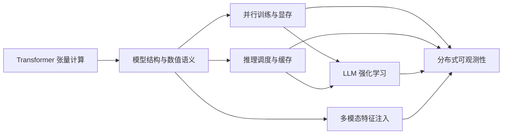

# AI-Infra 首页

> [!abstract]
> 目标：把每次阅读、代码追踪、训练诊断和架构讨论，沉淀成下一次可以直接复用的工程认知。

## 选择你的入口

| 我现在想…… | 入口 |
| --- | --- |
| 系统学习 Transformer 工程 | [[80_MOCs/Transformer 系统地图|Transformer 系统地图]] |
| 理解并行策略或重算显存 | [[20_Knowledge/Distributed/大模型并行训练|大模型并行训练]] · [[20_Knowledge/Memory/显存分析方法|显存分析方法]] |
| 追踪字段最终在哪里消费 | [[20_Knowledge/Systems/跨仓库调用链追踪|跨仓库调用链追踪]] |
| 分析训练失败或卡住 | [[40_Runbooks/分布式训练故障排查|分布式训练故障排查]] |
| 排查 OOM | [[40_Runbooks/OOM 排查|OOM 排查]] |
| 比较训练和推理数值 | [[40_Runbooks/跨 Runtime 数值对齐|跨 Runtime 数值对齐]] |
| 理解 rollout 到 loss 的链路 | [[20_Knowledge/RL/LLM 强化学习训练链路|LLM 强化学习训练链路]] |
| 整理一篇新资料 | [[91_AI/Wiki 维护工作流#Ingest|Ingest 工作流]] |

## 当前知识主轴

## 回答工程问题的五个镜头

1. **语义**：这个量或模块在算法上代表什么？
2. **张量**：shape、dtype、layout、mask 和单位是什么？
3. **执行**：由谁创建，在哪个 phase、rank、process、thread、device 上运行？
4. **传输**：跨过了哪些序列化、RPC、collective、IPC 或 checkpoint 边界？
5. **证据**：代码、配置、日志和实验分别证明了什么，还缺什么？

## 待生长区域

- Attention、RoPE、Normalization、MoE 的独立深挖页。
- NCCL collective、通信成本模型与拓扑映射。
- KV cache、continuous batching、prefill/decode 分离。
- GRPO/PPO 的公式推导、mask 语义与 off-policy 边界。
- 多模态 packing、position IDs 与跨 runtime processor 对齐。
- 常见仓库的项目入口页与版本化架构地图。

## 最近演化

查看 [[70_Timeline/log|演化日志]]。完整目录见 [[index|总索引]]。
