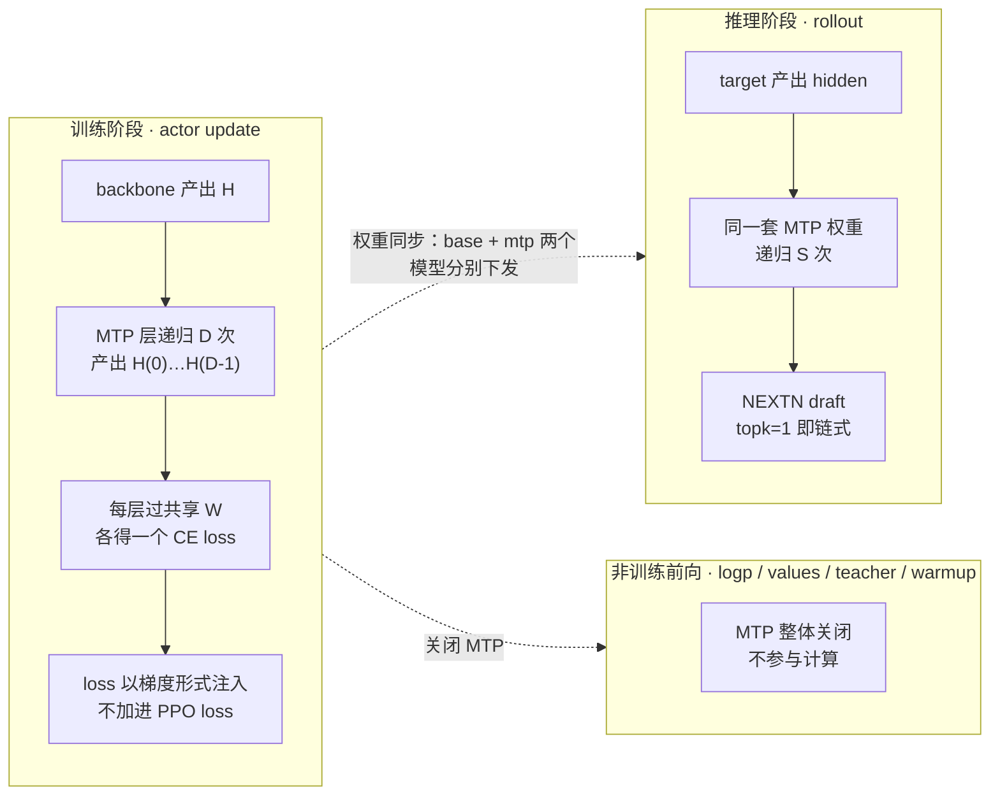
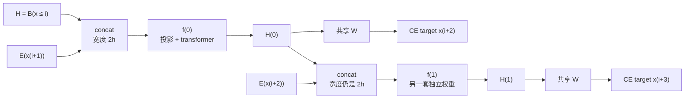
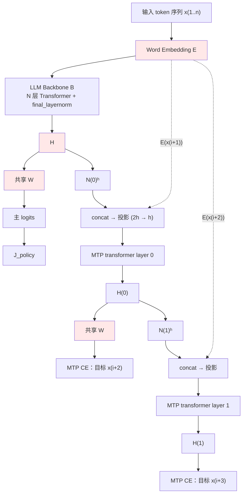
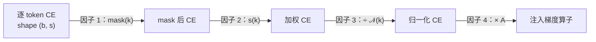
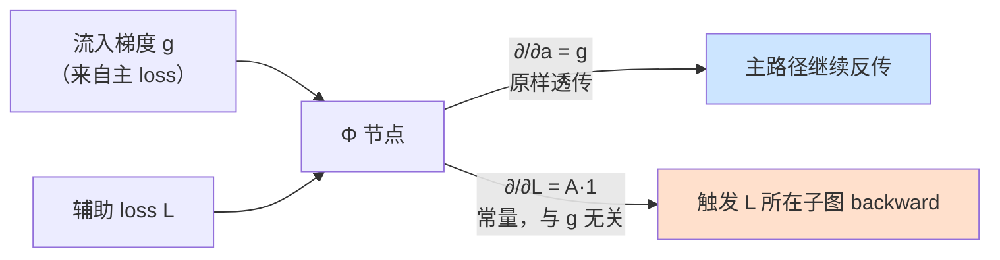
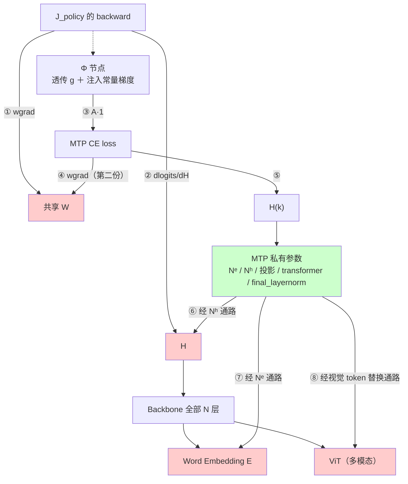
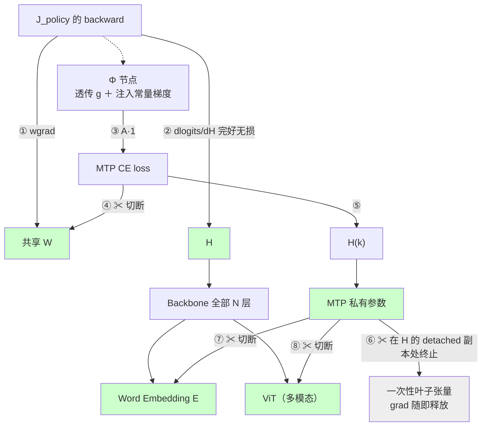
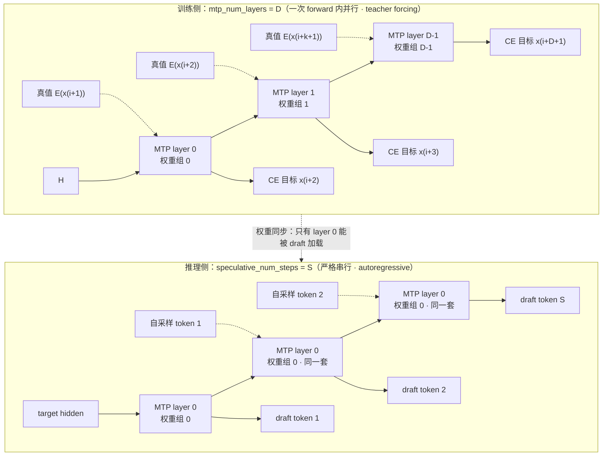
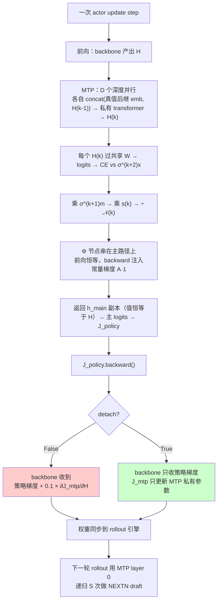

# MTP 在 RL 训练中的流程与优化目标（理论版）

> 本文只讲**理论**：MTP 在 RL 训练中要优化什么、梯度如何流动、`mtp_detach_from_backbone` 改变了什么。

---

## 0. 名词与记号

| 记号 | 含义 |
|---|---|
| `x(i)` | 序列中第 i 个 token（本文用圆括号写下标） |
| `E` | word embedding（词嵌入表） |
| `B` | LLM backbone（主干网络）：embedding 之后、LM head 之前的全部 N 层 transformer + `final_layernorm` |
| `H` | `B` 的最终输出表征，shape `[s, b, h]`。**与喂给主 LM head 的是同一个张量** |
| `W` | 共享 LM head 权重（tied embedding 时等于 `shared_embedding_or_output_weight()`） |
| `H(k)` | 第 k 层 MTP 的输出表征。**约定 `H(-1) ≡ H`** |
| `D` | `mtp_num_layers`，**训练侧** MTP 层数 = D 套**独立**权重 |
| `S` | `speculative_num_steps`，**推理侧** draft（草稿模型）递归次数 = **同一套**权重串行跑 S 次 |
| `σ` | 序列左移算子：`(σt)(i) = t(i+1)` |
| `m` | loss mask，RL 下即 `ppo_loss_mask` |
| `s(k)` | 第 k 层的辅助 loss 权重 |
| `A` | 全局 loss scale（fp16/bf16 动态 loss scaler × CP 补偿 ÷ num_microbatches） |
| `detach` | `mtp_detach_from_backbone` 的简写 |

---

## 1. MTP 在 RL 生命周期里的位置

MTP 模块在 RL 中扮演两个**互不相同**的角色：训练阶段被优化，rollout（采样）阶段被当作 speculative decoding（投机解码）的 draft 模型使用。两阶段的权重通过同步保持一致。



三条值得注意的边界：

- **rollout 不训练**。draft 前向在 no-grad 下进行，只产候选 token。
- **所有非训练前向整体跳过 MTP**。计算 actor 的 old/ref log-prob、critic value、teacher logits、warmup 时，MTP 模块被关闭——这些路径不需要辅助 loss，也不该产生任何梯度。
- **训练与推理的开关必须同开同关**。框架层有硬校验：`mtp_num_layers > 0` 与 `speculative_algorithm` 非空必须一致，否则提交任务即报错。

---

## 2. 问题设定：MTP 要学什么

主模型在位置 i 预测 `x(i+1)`。MTP 追加 D 个**串联**的小模块，让位置 i 同时预测 `x(i+2)` … `x(i+D+1)`。

两条设计约束决定了它的全部形态：

**约束一：不是 cross-attention（交叉注意力）。**
backbone 的 `H` 不作为 KV 被查询，而是作为一路**条件向量**：归一化 → 与后继 token 的 embedding 拼接 → 线性投影压回 h 维 → 送入一层 transformer。

**约束二：没有自己的输出头。**
MTP 复用主模型的 `W` 与 `E`，因此它输出的是**同一个词表空间**上的分布。这一条是理解"为什么 RL 要 detach"的钥匙（§7）。

---

## 3. 单层 MTP 的函数形式

第 k 层（`k = 0 … D-1`）的映射：

$$
H^{(k)} \;=\; f_k\Big(\; N_k^{e}\!\big(E(\sigma^{k+1}x)\big)\;\Vert\; N_k^{h}\!\big(H^{(k-1)}\big) \;\Big)
$$

其中：

- `N_k^e`、`N_k^h`：第 k 层私有的两个 normalization（对应 `enorm` / `hnorm`）
- `‖`：沿 hidden 维拼接，得 `[s, b, 2h]`
- `f_k`：第 k 层私有的线性投影（`2h → h`）+ 一层完整 transformer + `final_layernorm`
- `H^(-1) ≡ H`

`N_k^e`、`N_k^h`、`f_k` 的参数**逐层独立**，是 MTP 唯一私有的权重。共享的只有 `E`、`W` 和作为条件的 `H`。

### 3.1 shift 算子与逐深度目标

令进场时的标签为 `labels⁰ = σx`（即 `labels⁰(i) = x(i+1)`）。第 k 层的目标与 mask：

$$
\text{target}^{(k)} = \sigma^{k+2}x
\qquad
\text{mask}^{(k)} = \sigma^{k+1}m
\qquad
\text{condition}^{(k)} = E(\sigma^{k+1}x)
$$

展开成表：

| 深度 | hidden 输入 | 拼进去的条件 embedding | 预测目标 | mask |
|---|---|---|---|---|
| 主 head | `H` | — | `x(i+1)` | `m` |
| `k = 0` | `H` | `E(x(i+1))` | **`x(i+2)`** | `σm` |
| `k = 1` | `H(0)` | `E(x(i+2))` | **`x(i+3)`** | `σ²m` |
| `k` | `H(k-1)` | `E(x(i+k+1))` | **`x(i+k+2)`** | `σ^(k+1)m` |

三个推论：

1. **causal chain（因果链）** 指 `H(k-1)` 这一列：每层的 hidden 输入是**上一层 MTP 的输出**，不是 backbone 的 `H`。
2. **每加一层深度，每个样本尾部多掉 1 个 token 出 loss**——因为 `σ^(k+1)m` 每滚一次就把一个有效位置挤出序列。`D = 1` 时可忽略。
3. **σ 的边界语义**：滚进来的位置填哨兵值（0），同时 `mask` 同步滚动使该位置为 0。两条保证叠加，使打包序列（packed sequence）的样本跳变点不会被学成"跨样本预测"。哨兵值 0 是合法 token id，CE 仍会被计算，但随后被 mask 乘成 0，梯度为 0——**因为 masking 发生在 CE 之后**（CE 采用 `reduction = none` 语义）。

### 3.2 滑动窗口视角

`σ` 的全部效果，可以理解成**两套窗口在同一条序列上朝相反方向滑动**。

#### 图 A：深度 × 位置的二维网格

示例延用 §11：序列长度 8（位置 `0…7`），response 段为位置 `{3,4,5,6}`。格子 = 该位置是否计入 loss，最右列 = 该格预测哪个 token。

```
position     │  0   │  1   │  2   │  3   │  4   │  5   │  6   │  7   │ mask        target
─────────────┼──────┼──────┼──────┼──────┼──────┼──────┼──────┼──────┼────────────────────────
token        │ x(0) │ x(1) │ x(2) │ x(3) │ x(4) │ x(5) │ x(6) │ x(7) │
m            │  .   │  .   │  .   │  1   │  1   │  1   │  1   │  .   │ (PPO mask)
─────────────┼──────┼──────┼──────┼──────┼──────┼──────┼──────┼──────┼────────────────────────
main head    │  .   │  .   │  .   │  1   │  1   │  1   │  1   │  .   │ m           x(i+1)
depth 0      │  .   │  .   │  1   │  1   │  1   │  1   │  .   │  .   │ σm          x(i+2)
depth 1      │  .   │  1   │  1   │  1   │  1   │  .   │  .   │  .   │ σ²m         x(i+3)
─────────────┴──────┴──────┴──────┴──────┴──────┴──────┴──────┴──────┴────────────────────────
depth k      │ ← 监督窗口整体左移 k+1 格（基数不变）→ │ σ^(k+1)m    x(i+k+2)
```

`1` = 该位置计入 loss，`.` = 被 mask 掉。

两套窗口的滑动方向**相反**，这一点最容易看反：

| 随 depth `k` 递增 | 滑动方向 | 成因 |
|---|---|---|
| **监督窗口**（哪些位置产 loss）= `σ^(k+1)m` | 向**左平移** `k+1` 格，**基数不变** | 见下 |
| **预测目标**（每格预测谁）= `σ^(k+2)x` | 向**右滑动** `k+2` 格 | 目标本身在往后看 |

**监督窗口为什么左移**：`mask^(k)(i) = m(i+k+1)`，即位置 `i` 在深度 `k` 计入 loss 的充要条件是

$$
x(i+k+1)\ \text{本身是 response token}
$$

——也就是**该深度最新吃进的那个条件 token 必须落在 response 段内**。response 段位于每个样本尾部，`i+k+1` 每加 1 就把越界的 `i` 挤出去一个，于是窗口的左右两端同步左移 1 格，总数不变。

`D = 1` 时只有主 head 与 depth 0 两行，监督集合从 `{3,4,5,6}` **平移**到 `{2,3,4,5}`：右端丢掉位置 6（§3.1 推论 2 说的"尾部掉 token"），左端**同时纳入**位置 2。所以不是"学的 token 变少了"，而是**同一批 response token 的延续，被要求在更远的 lookahead 距离上预测**——`k` 越大，预测间隔 `k+2` 越长。这对 packed sequence 逐样本成立，样本之间互不串味。

#### 图 B：固定位置，看已知窗口如何随 depth 增长

取 `i = 2`：

| depth k | 位置 2 的 hidden 输入 | 其中已吸收的真值 token | 新拼接的条件 token | 输出 | 预测目标 | 间隔 |
|---|---|---|---|---|---|---|
| 0 | `H(2)` = backbone 对 `x(0..2)` 的表征 | 无 | `E(x(3))` | `H(0)(2)` | `x(4)` | 2 |
| 1 | `H(0)(2)` | `x(3)` | `E(x(4))` | `H(1)(2)` | `x(5)` | 3 |
| 2 | `H(1)(2)` | `x(3..4)` | `E(x(5))` | `H(2)(2)` | `x(6)` | 4 |

一般式：位置 `i` 处的**已知未来窗口** = `{x(i+1) … x(i+k+1)}`（长度 `k+1`，逐深度 +1）；**预测间隔** = `k+2`。

关键在于**每层只"新吃"一个真值 token**——更早的已知 token 已经烘焙进 `H(k-1)`，不再重新拼接。

这里有个必须讲清的细节：**窗口是在链上"长大"的，不是把 concat 越拼越宽。**



拼接宽度**恒为 `2h`**（一个 token embedding + 一个 hidden），不随 depth 增长；增长的是 `H(k)` 里已经烘焙进去的信息量。这与 §2 约束一"不是 cross-attention"一致——没有可增长的 KV 缓存，只有一个固定宽度的条件向量在链上被反复重写。

#### 与 rollout 侧滑动窗口的关系

`D` 个深度是**一次 forward 内并行**滑出的 D 个窗口，每个窗口用**独立权重**、吃**真值** token；推理侧 `S` 步是**串行**滑出的 S 个窗口，全部用 `layer 0` 的**同一套**权重、吃**自己采样的** token。窗口滑动这件事两者相同，窗口的"填充物"不同——详见 §9。

---

## 4. 前向计算图



<sub>红色 = **与 backbone 共享**的张量/权重。MTP 私有的只有 `N^e` / `N^h` / 投影 / `transformer_layer` / `final_layernorm`。</sub>

---

## 5. 优化目标

### 5.1 主目标（RL 策略）

$$
J_{\text{policy}} = -\,\mathbb{E}\Big[\min\big(r_i(\theta)\,\hat A_i,\ \operatorname{clip}(r_i(\theta))\,\hat A_i\big)\Big] \;+\; \beta\,\mathrm{KL}
$$

`r_i(θ) = π_θ(a_i|s_i) / π_old(a_i|s_i)` 是 importance ratio（重要性采样比）。只在 response token 上计算（由 `m` 决定）。**它对 MTP 一无所知**。

### 5.2 辅助目标（MTP，逐深度）

对每层 `k ∈ [0, D)`：

$$
J_{\text{mtp}}^{(k)} \;=\; \sum_{b,i} \operatorname{mask}^{(k)}[b,i]\cdot w[b,i]\cdot \mathrm{CE}_k[b,i]
$$

$$
\mathrm{CE}_k[b,i] \;=\; -\log \operatorname{softmax}\!\big(W\,H^{(k)}[b,i]\big)_{\;\sigma^{k+2}x[b,i]}
$$

`w[b,i]` 是可选的逐 token 权重（RL 下恒为 1）。

> 线性写法：`J_mtp(k) = Σ(b,i) mask(k)(b,i) · w(b,i) · CE_k(b,i)`，其中 `CE_k(b,i) = −log softmax(W · H(k)[b,i]) 在 token x(i+k+2) 处的分量`。

**含义**：在 mask 允许的位置上，最大化"经**共享** head 解码出 `x(i+k+2)`"的概率。没有正则项、没有蒸馏项、没有 KL。

### 5.3 归一化与总目标

令 `𝒩_k` 为第 k 层的归一化分母（有效 token 数），`s(k)` 为该层权重，`A` 为全局 loss scale：

$$
\boxed{\;J \;=\; J_{\text{policy}} \;+\; A\cdot\sum_{k=0}^{D-1} s_k \cdot \frac{1}{\mathcal N_k}\, J_{\text{mtp}}^{(k)}\;}
$$

> 线性写法：`J = J_policy + A · Σ(k) s(k)/𝒩(k) · J_mtp(k)`

各因子：

| 因子 | 取值 |
|---|---|
| `s(k)` | `mtp_loss_scaling_factor / D`（标量配置时按层均分；也可逐层给 list）。RL 配置：`0.1 / 1 = 0.1` |
| `𝒩_k` | RL 配置下退化为**packed micro-batch 内的有效 token 数**（`micro_batch_size = 1`、序列打包，故 sequence-mean 与 token-mean 重合） |
| `A` | `loss_scale × cp_size / num_microbatches`。其中 `loss_scale` 来自 fp16/bf16 动态 loss scaler，`× cp_size` 补偿 context parallel（上下文并行）下 CP-local 的归一化分母，`÷ num_microbatches` 对齐主 loss 的 micro-batch 平均 |



### 5.4 最重要的一条性质

> **这个 `J` 从来没有作为一个标量被计算或返回过。**

调度器拿到的是 logits，loss 函数只算 `J_policy`。`J_mtp` 纯粹以**梯度**的形式存在。因此训练日志的主 `loss` 里永远看不到它——它有独立指标 `mtp_(k+1) loss`，其值是一个**真正的 per-token CE 均值**，且在 CP 与 DP 维度上分别做过 SUM 与 AVG，因此是 micro-batch-size 不变量，可以直接与预训练的 CE 曲线横向比较。**这是判断 MTP 到底有没有在学的唯一直接信号。**

---

## 6. 梯度注入：加法目标如何用非加法手段实现

### 6.1 算子定义

既然不构造 `J_policy + λ·J_mtp` 这个标量，就需要一个机制让 `J_mtp` 的梯度在 backward 时凭空出现。MTP 使用一个自定义 autograd 算子 `Φ`：

$$
\Phi(a,\ \mathcal L) \;=\; a \qquad\text{（前向恒等）}
$$

$$
\text{backward：给定流入梯度 } g \;\Longrightarrow\;
\frac{\partial}{\partial a} = g,
\qquad
\frac{\partial}{\partial \mathcal L} = A\cdot\mathbf 1
$$



两个性质：

| 返回位 | 值 | 后果 |
|---|---|---|
| 对 `a` | `g` | **主 loss 梯度原样透传**，完全不受 MTP 影响 |
| 对 `L` | `A·1` | **与 `g` 无关的常量**，等价于触发 `L.backward(ones)` |

### 6.2 串联方式

`Φ` 串在**主路径**上，而不是串在 MTP 分支上。深度 k 的调用为：

$$
h_{\text{main}}^{(k)} \;=\; \Phi\!\Big(h_{\text{main}}^{(k-1)},\ \; s_k\cdot \tfrac{1}{\mathcal N_k} J_{\text{mtp}}^{(k)}\Big),
\qquad h_{\text{main}}^{(-1)} \equiv H
$$

最终返回 `h_main^(D-1)` 的副本。因为 `Φ` 前向恒等，**返回值的数值与 `H` 逐位相同**——主 logits 由一个"值等于 `H`、但 autograd 图上挂了 D 个 MTP 节点"的张量算出。

### 6.3 为什么这等价于加法目标

设主 loss 的 backward 流入最外层 `Φ` 节点的梯度为 `g`。逐层展开：

$$
\frac{\partial J}{\partial \theta}
\;=\; \underbrace{g^{\!\top}\frac{\partial H}{\partial \theta}}_{=\ \partial J_{\text{policy}}/\partial\theta}
\;+\; \underbrace{A\cdot\sum_{k=0}^{D-1} \frac{\partial}{\partial\theta}\Big(s_k\cdot \tfrac{1}{\mathcal N_k} J_{\text{mtp}}^{(k)}\Big)}_{\text{由常量分支触发}}
$$

第一项来自主路径的透传，第二项来自每个节点的常量分支。这正是 §5.3 中 `J` 对 `θ` 的梯度。

> **结论**：只要主 loss 的 backward 流过这些节点，D 份 MTP 子图就会被以固定 scale 各反传一次。`J_mtp` 在效果上与 `J_policy` 相加，但从不需要被求值、从不进入 loss 标量、从不参与 loss scaling 的溢出检测。

---

## 7. 反向梯度流：`detach` 改变了什么

### 7.1 `detach = False`（预训练语义）

箭头方向 = **梯度流动方向**。红色 = 被 MTP 梯度触及的共享张量。



此时 backbone 收到 `∂J_policy/∂H + 0.1 × ∂J_mtp/∂H` 的叠加。

### 7.2 `detach = True`（RL 配置）



### 7.3 逐边处置

| # | 梯度边 | `detach=False` | `detach=True` |
|---|---|---|---|
| ① | policy → `W` | ✅ 训 | ✅ 训（不变） |
| ② | policy → `H` → backbone | ✅ 训 | ✅ 训（**不变**） |
| ③ | Φ → MTP CE（常量注入） | ✅ | ✅（不变） |
| ④ | MTP CE → `W` 的 wgrad | ✅ 训 | ✂ **切断** |
| ⑤ | MTP CE → `H(k)` → MTP 私有参数 | ✅ 训 | ✅ **训（逐元素不变）** |
| ⑥ | MTP → `H` → backbone | ✅ 训 | ✂ **切断** |
| ⑦ | MTP → word embedding | ✅ 训 | ✂ **切断** |
| ⑧ | MTP → ViT | ✅ 训 | ✂ **切断** |
| — | MTP → nGPT 的 `finalnorm`（共享参数） | ✅ 训 | ✂ **切断** |

三条实现无关的理论保证：

1. **主路径毫发无伤**：`Φ` 的 `a` 侧输入是**未 detach 的原始 `H`**，detach 只作用于送给 MTP 分支的**副本**。捕获顺序不能反——若先 detach 再捕获，主 loss 梯度会被切断，且**不报错**，只是模型悄悄不学。
2. **detach 只删边、不改值**：`detach()` 不改数值，前向逐位一致，因此 MTP 私有参数的梯度**逐元素不变**（不是近似）。拿到梯度的参数**集合**也完全相同。
3. **必须补 `requires_grad`**：激活重算（activation checkpointing）走 reentrant 模式时，重算区间需要**至少一个带 requires_grad 的输入**才会重建计算图。若不补，`detach` 掉的两个叶子会让 MTP 私有参数**也**收不到梯度。

### 7.4 配置约束

`detach = True` 只允许 causal-chain 形态（`mtp_block_type = "m"` 且未开启 `mtp_without_causal_chain`），否则构造期报错。原因：

- 若关闭 causal chain，每层直接吃 `H`，切断 `H` 就等于切断 MTP 的唯一输入；
- 另一种 MTP 变体（`'k'` 型）的主路径张量取自序列 chunk 之后的半段，detach 会同时废掉主 loss 通路。

---

## 8. 为什么 RL 必须 detach

三条独立理由，任一条都足够。

**① 保住 PPO 的数学前提。**
importance ratio `r_i = π_θ(a_i|s_i) / π_old(a_i|s_i)` 假设"两次 forward 之间，模型只被策略目标改动"。若 `J_mtp` 也在推 backbone，`π_old` 会被一个 0.1 系数的语言建模信号拖着走，ratio 的分母语义被悄悄改变，clip 与 KL 惩罚都建立在错误假设上。

**② 共享 head 会被辅助任务重塑。**
MTP 想抬高 `W·H(k)` 里 `x(i+k+2)` 的坐标，它有两个杠杆：改 `W`，或改 `H(k)`。

$$
\frac{\partial\,\mathrm{CE}_k}{\partial H^{(k)}} \;=\; W^{\!\top}\Big(\operatorname{softmax}(W H^{(k)}) - \mathbf e_{\,\sigma^{k+2}x}\Big)
$$

- `detach=False`：两个杠杆都能用 → **主策略的解码分布被辅助 CE 改写**。
- `detach=True`：第 4 条边被切断，只剩第二个杠杆 → MTP 必须学会"把 `H` 与已知后继 token 重新混合，产出一个**现有 head 一解码就正好是** `x(i+k+2)` 的 `H(k)`"。

后者才是投机解码需要的能力：**draft 用的就是主 head，它没有自己的输出层可选**。

**③ 多模态多一层。** 视觉特征被替换进 MTP 的条件 embedding 后，`detach=False` 会让一个 0.1 系数的 CE 去训 ViT。

> ⚠️ **`detach=True` 时 `W` 并没有被冻结**——它仍在被 PPO 梯度更新。所以 MTP 是在追一个**只由策略目标驱动的移动靶**。这与"冻结 MTP 自身不参与训练"是完全相反的两件事。
>
> 也因此，`detach=True` 下 `mtp_loss_scaling_factor` 的语义收窄了：它**只调节 MTP 自己学多快**，不再决定"语言建模信号与策略信号在 backbone 中的梯度配比"。`detach=False` 时那个 `0.1` 是真正在跟 PPO 抢 backbone，调参代价完全不同。

---

## 9. `D` 与 `S`：两个不同的轴

`D`（训练侧 MTP 层数）与 `S`（推理侧 draft 递归次数）都表达"一次覆盖多少个未来 position"，因此极易被当成同一旋钮的两端。**它们不是。**



| 轴 | `D`（Megatron，训练） | `S`（SGLang，rollout） |
|---|---|---|
| 一次前向覆盖的未来 position 数 | `D` | `S` |
| **用多少套权重** | **D 套独立**、各自深度特化 | **1 套，复用 S 次** |
| **每步的 token 输入** | **真值** token（teacher forcing） | **自己上一步采样的** token（autoregressive） |
| hidden 输入链 | `H(k-1)` | 上一步 draft 的输出 hidden |
| 是否 decode 出 token | **否**，只产 CE loss | 是，每轮提出 S 个 draft token |
| 执行方式 | D 个深度在一次 forward 内**并行** | S 步**串行** |

### 9.1 类比只在一根轴上成立

- ✅ **递归形状**成立：两者都是 chained hidden，都覆盖多个未来位置。
- ❌ **权重语义**不成立：`S` 类比的是"**一套**权重链式展开 S 次"，不是"S 套不同权重各管一个深度"。要让类比严格成立，需要 `D = S` **且各层权重 tie（绑定共享）**——本 stack 既不 tie，draft 侧也不接收多层。
- ❌ **监督语义**不成立：`D > 1` 时 depth k 用真值前缀监督；`S > 1` 时 step j 消化自己 step j-1 的采样结果。这个分布差就是 exposure bias（暴露偏差，指模型训练时只见真值前缀、部署时却要消化自己的错误输出），随 `S` 累积。

### 9.2 决定性约束：draft 模型物理上只有一层

本 stack 的 NEXTN draft 模型**硬限制为单层**，只映射到 `mtp.layers.0`。

⇒ **`D = 3` 训出来的 layer 1、2 在 rollout 中永远不会被加载。**

旁证：全部 RL 示例配置里 `mtp_num_layers` 只出现 `1` 与 `0`，**从无 >1**；`speculative_num_steps` 只出现 `3`。框架层的开关校验也只检查"训练侧与推理侧 MTP 同开同关"，**不校验深度**。

### 9.3 实践含义

| 想达到的效果 | 该调的旋钮 | 代价 |
|---|---|---|
| draft 每轮多提几个 token（提升 rollout 吞吐） | `S` ↑ | **零训练改动**；exposure bias 随 `S` 累积，接受率随深度下降 |
| 训练期多一份辅助监督 | `D` ↑ | 多 `D-1` 个 CE 项，`s(k)` 被摊薄；**对 rollout draft 无直接收益** |

`detach=True` 时第二行更弱：那份额外监督只塑造 MTP 自己的私有参数，backbone 完全不受影响（§7.2），而 layer 1..D-1 又进不了 draft 模型。**因此本 stack 下 `D > 1` 几乎没有正收益**——这也解释了为什么所有配置都是 `D = 1`。

---

## 10. 训练侧一次 forward 产出什么

澄清一个高频误解："Megatron 侧一次 MTP forward 会 draft 出几个 token？"

| 口径 | 答案 |
|---|---|
| **严格口径**：decode 出多少 token | **0 个**。MTP forward 不含任何 `argmax` / 采样操作，产物是 logits → CE loss，不是 token id |
| **有用口径**：监督多少个未来 position | **每 position `D` 个**，目标为 `x(i+2)` … `x(i+D+1)`。`D = 1` ⇒ 只监督 `x(i+2)` |
| 整个 micro-batch 的总预测数 | `D × `（`σ^(k+1)m` 中为 1 的位置数）。**不是** `D × s × b`——prompt 段与打包跳变点不计 |
| forward 的返回值 | 只有 `h_main^(D-1)` 的副本，shape `[s, b, h]`，**数值恒等于 `H`** |

Megatron 自带的推理引擎不做投机解码；投机解码只存在于 rollout 引擎侧。**训练侧与推理侧对 MTP 的用法是完全不同的两件事，共享的只是权重。**

---

## 11. 数值算例

设 packed micro-batch：`micro_batch_size = 1`，padded 长度 8，单个样本占位 `[0, 8)`，response 段为位置 `{3,4,5,6}`，即 `m` 在这 4 个位置为 1。`D = 1`，`mtp_loss_scaling_factor = 0.1`，`cp_size = 1`，`num_microbatches = 1`。

**Step 1 — 进场**
$$
\text{labels}^0(i) = x(i+1),\qquad m(i) = \mathbb 1[i \in \{3,4,5,6\}]
$$

**Step 2 — depth 0 施加 σ**
$$
\text{condition}^{(0)} = E(\sigma x),\quad
\text{target}^{(0)} = \sigma^2 x,\quad
\text{mask}^{(0)} = \sigma m = \mathbb 1[i \in \{2,3,4,5\}]
$$

$$
\mathcal N_0 = \textstyle\sum_i \text{mask}^{(0)}(i) = 4,\qquad s_0 = 0.1/1 = 0.1
$$

**Step 3 — 逐 token 贡献**
$$
\text{per\_token}(i) \;=\; s_0\cdot\frac{\text{mask}^{(0)}(i)\cdot \mathrm{CE}_0(i)}{\mathcal N_0}
\;=\; 0.025\cdot \mathrm{CE}_0(i)\quad \text{for } i\in\{2,3,4,5\}
$$

**Step 4 — 全局 scale**
$$
A = \text{loss\_scale}\times\frac{\text{cp\_size}}{\text{num\_microbatches}} = 1\times\frac{1}{1} = 1
$$

**Step 5 — 实际施加的等价目标**
$$
J_{\text{mtp}} \;=\; 0.025\times\Big[\mathrm{CE}_0(2)+\mathrm{CE}_0(3)+\mathrm{CE}_0(4)+\mathrm{CE}_0(5)\Big]
$$

其中 `CE_0(i) = −log softmax(W · H(0)[i])` 在 `x(i+2)` 处的分量。

**与主 loss 对照**：同一个 packed batch 里，`J_policy` 在位置 `{3,4,5,6}` 上算、预测 `x(i+1)`；`J_mtp` 在位置 `{2,3,4,5}` 上算、预测 `x(i+2)`。**有效窗口整体左移一位**，这正是 σ 的效果。

---

## 12. 一图总结



---

## 参考

- DeepSeek-V3 Technical Report §Multi-Token Prediction —— MTP 结构、causal chain 与共享 head 设计的出处
- EAGLE / NEXTN speculative decoding —— draft 递归与 acceptance sampling 的通用范式
