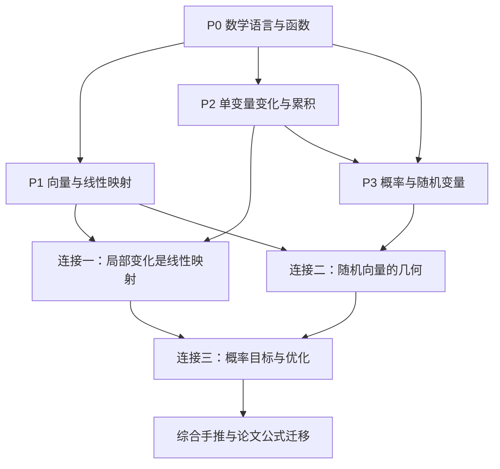

# Roadmap — 从数学基础到三个连接

> [!warning]
> 本文是 AI 设计的学习路线，尚未完成人工核验。公式列为未来推导目标，不代表已经授课或通过检索；资源已核对入口与主题，具体推导须在备课时逐项核对。

## 路线与进度

目标见 [[10_Projects/LLM Math Foundations/MISSION|Mission]]。按概念依赖推进：先认识对象，再理解局部变化与随机性，最后形成综合推导能力。以下阶段不是单节 lesson，授课时拆成一次只获得一个具体能力的小课。

P2 的积分基础用于 P3 的连续分布部分；离散概率可以先学。图表示先修关系，默认按下表从上到下推进；诊断后可调整已熟悉内容的深度。

| 阶段 | 核心概念及推荐顺序 | 阶段检查点 | 状态 |
|---|---|---|---|
| P0 数学语言 | 集合与索引 → 求和与乘积 → 函数、定义域与复合 → 指数、对数、基本三角函数 → 等式、近似、比例关系 | 展开带索引的公式；解释复合顺序；识别自由变量与求和指标 | 待诊断 |
| P1 线性代数基础 | 向量与坐标 → 线性组合、span、基 → 矩阵作为线性映射 → 复合与转置 → 内积、norm、正交投影 → rank 与 null space | 从矩阵的列解释乘法；手算二维投影；说明解何时不唯一 | 未开始 |
| P2 单变量微积分 | 极限与连续 → derivative → product / chain rule → differential 与一阶近似 → 积分与累积 → 微积分基本定理 | 从差商推出简单导数；解释线性近似的局部性；用积分计算累积量 | 未开始 |
| C1 连接一 | 偏导数 → directional derivative → gradient 与 Jacobian → total differential → 多变量 chain rule → Hessian 与二阶近似 | 将局部变化写成线性映射并推导复合规则 | 未开始 |
| P3 概率基础 | 样本空间与事件 → 条件概率与 Bayes rule → 随机变量 → PMF / PDF / CDF → 联合、边缘、条件分布 → expectation、variance、independence | 区分密度与概率；从定义算期望与方差；区分独立与不相关 | 未开始 |
| C2 连接二 | 随机向量 → covariance → 线性变换 → quadratic form → 对称矩阵的 eigenvectors 与非负特征值 | 推导投影方差，解释 covariance 的几何含义 | 未开始 |
| C3 连接三 | 参数化分布 → likelihood 与 log-likelihood → empirical objective → gradient descent → least squares → categorical likelihood、softmax 与 cross-entropy | 从概率假设构造目标，再独立求导并解释更新 | 未开始 |
| X 综合迁移 | 同一个问题的几何、概率、微积分三种解释；阅读简短的新公式并补全步骤 | 完成综合题及间隔后的变式检索 | 未开始 |

基础起点尚未评估。首轮诊断覆盖函数复合、求和、二维向量与变化率；用于选择首课，不直接推断整门学科已掌握。

自学补充见 [[10_Projects/LLM Math Foundations/RESOURCES#入门选择与先修要求|课程选择与先修要求]] 和 [[10_Projects/LLM Math Foundations/RESOURCES#按问题查阅|按问题查阅入口]]。P1 可配合 R6 + R1，P2 配合 R7 + R2；后续三个连接继续使用下文的资源组合。

## 连接一：线性代数 → 微积分

**核心问题：非线性函数在一点附近，能否用一个线性映射描述变化？**

先修：P1 的线性映射与复合，P2 的导数与局部近似。先在一维比较函数与切线，再进入二维、一般 shape，最后手推 chain rule。偏导数存在本身不应被当作全可微的充分条件。

设 $f:\mathbb R^n\to\mathbb R^m$ 在 $x$ 可微，输入扰动为 $h\in\mathbb R^n$，Jacobian 为 $J_f(x)\in\mathbb R^{m\times n}$。目标是理解并使用：

$$
f(x+h)=f(x)+J_f(x)h+r(h),
\qquad
\frac{\lVert r(h)\rVert}{\lVert h\rVert}\to0
\quad(h\to0).
$$

再设 $g:\mathbb R^m\to\mathbb R^k$ 在 $f(x)$ 可微，推导：

$$
J_{g\circ f}(x)=J_g(f(x))J_f(x).
$$

**Recall gate**：选一个二维非线性函数，计算 Jacobian，预测小扰动的输出变化；写出复合 Jacobian 的 shape 和乘法顺序；说明近似误差为什么不能在任意大扰动下忽略。随后用分量求导与 differential 两种写法核对一个标量函数的 gradient。

资源：[[10_Projects/LLM Math Foundations/RESOURCES|R1、R2、R3、R5]]。完成后可用 backpropagation 作应用检验。

## 连接二：线性代数 → 概率论

**核心问题：随机向量沿某个方向的波动，如何由一个矩阵描述？**

先修：P1 的内积、投影与转置，P3 的期望、方差、联合分布。先用二维离散随机向量手算，再引入 covariance matrix，最后补 quadratic form 与对称矩阵的特征方向。

设随机向量 $X\in\mathbb R^d$ 有有限二阶矩，均值 $\mu=\mathbb E[X]$，covariance matrix $\Sigma\in\mathbb R^{d\times d}$：

$$
\Sigma=\mathbb E[(X-\mu)(X-\mu)^\top].
$$

对确定的单位向量 $u\in\mathbb R^d$，从定义推导标量投影的方差：

$$
\operatorname{Var}(u^\top X)=u^\top\Sigma u.
$$

再设确定矩阵 $A\in\mathbb R^{k\times d}$、向量 $b\in\mathbb R^k$，推导：

$$
\operatorname{Cov}(AX+b)=A\Sigma A^\top.
$$

**Recall gate**：从一个给定的二维联合分布计算均值与 covariance；比较两个方向的投影方差；解释平移为何不改变 covariance；给出“不相关但不独立”的例子。推导上述变换规则不要求各坐标独立。

资源：[[10_Projects/LLM Math Foundations/RESOURCES|R1、R4、R5]]。完成后可用 PCA 或带明确假设的 attention variance scaling 作应用检验。

## 连接三：概率论 → 微积分与优化

**核心问题：概率假设如何产生训练目标，目标又如何产生参数更新？**

先修：C1 的 gradient 与 chain rule、P3 的条件概率与分布；使用 C2 的随机向量语言。先区分固定数据与待估参数，再走 likelihood → negative log-likelihood → gradient → 更新的完整链。补一阶 Taylor approximation 对下降方向的解释，以及步长过大可能不下降的例子。

综合对象采用 linear regression。设 $X\in\mathbb R^{n\times d}$ 为固定 design matrix，第 $i$ 行为 $x_i^\top$，参数 $w\in\mathbb R^d$，观测向量 $y\in\mathbb R^n$。假设给定 $X,w$ 时观测条件独立，且：

$$
y_i\mid x_i,w\sim\mathcal N(x_i^\top w,\sigma^2),
\qquad \sigma^2>0\text{ 固定}.
$$

第一步从 Gaussian density 推导：

$$
-\log p(y\mid X,w)=\frac{1}{2\sigma^2}\lVert Xw-y\rVert_2^2+C,
$$

其中 $C$ 与 $w$ 无关。随后定义缩放后的目标 $L(w)=\frac12\lVert Xw-y\rVert_2^2$，推导：

$$
\nabla_w L=X^\top(Xw-y).
$$

两种目标的最优参数相同，但 gradient 相差尺度；不能据此断言同一 learning rate 下更新轨迹相同。再联系驻点条件 $X^\top(Xw-y)=0$ 与正交投影，并检查 $X$ 的 rank 对解唯一性的影响。

最后迁移到 categorical distribution。设单样本 logits 为 $z\in\mathbb R^K$，$p=\operatorname{softmax}(z)$，固定目标分布 $q\in\mathbb R^K$ 满足 $q_j\ge0$、$\sum_jq_j=1$。推导：

$$
\ell(z)=-\sum_{j=1}^Kq_j\log p_j,
\qquad \nabla_z\ell=p-q.
$$

先处理 one-hot label 的 categorical negative log-likelihood，再扩展至一般目标分布的 cross-entropy。

**Recall gate**：独立完成 Gaussian likelihood 到 squared error 的推导；分别用分量与 differential 求 gradient；解释常数删除与尺度变化的区别；推导 softmax cross-entropy gradient，注明单样本与 batch mean 的差别。

资源：[[10_Projects/LLM Math Foundations/RESOURCES|R3、R4、R5]]。完成后进入 language-model objective 或 regularization 的应用检验。

## 如何推进和判断完成

每个小课按“定义 → 最小例子 → 几何或变化解释 → 关键推导 → 条件与反例 → 独立检索”组织。基本证明要保留关键步骤；允许先用低维例子建立直觉，再推广一般形式。

首次检索检查能否无提示解释与手推；之后在下一次学习开始时或数日后的会话中安排变式检索。暂不创建定时任务。卡住时回到对应先修节点补一个小单元，再返回主线。

阶段状态可依证据更新为“学习中 / 首次检索通过 / 间隔检索通过”。只有用户表现出的理解、明确自述的基础或已纠正误区才进入 learning record，教师讲过的内容不算通过。

首轮完成条件：三个连接均能独立解释和推导，并能在一个未原样演练的低维问题中标注 shape、补全关键步骤、说明条件。暂缓高阶积分技巧、完整谱理论、测度论和收敛证明；如成为实际理解障碍，再增加支线。

## 课程文件约定

本文件是阶段状态和依赖关系的唯一索引。创建具体 lesson 时，再在此追加其编号与所属阶段；不预占整套课号。Lesson 使用独立的 `0001-<topic>.html` 顺序编号，learning record 按 teach 规则独立递增并关联对应 lesson，不从另一个项目继承编号。当前尚未创建任何 lesson 或 record。
