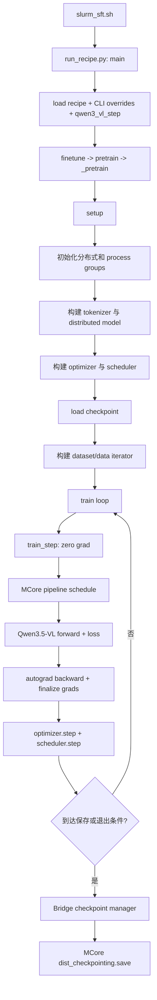
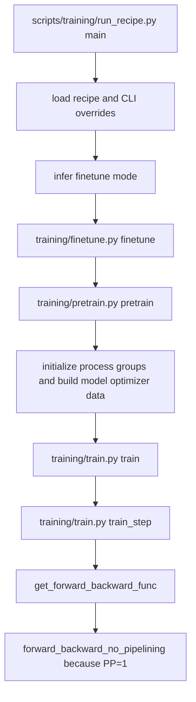
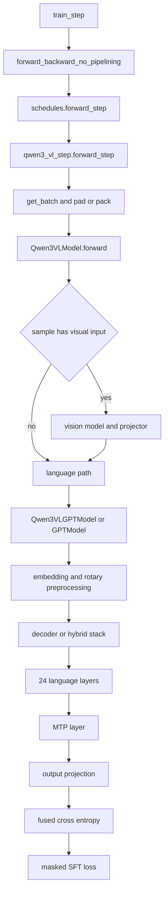
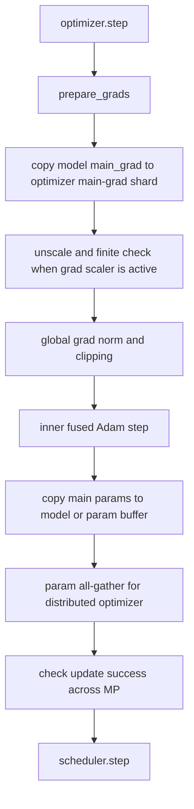

# Qwen3.5-VL SFT 的 Megatron 代码链路与观测指南

> [!warning]
> 本文包含 AI 生成或整理的实质内容，尚未完成人工核验。代码路径与结论绑定到文中记录的 commit；本次知识库整理未重新访问对应 checkout、训练日志或 GPU trace。

> [!info] 文档归属与证据口径
> - 所属项目：[[_Project - MiniMind Megatron Bridge|MiniMind-V Megatron Bridge 接入]]。
> - “当前支持”“当前实现”等表述来自原文对固定 commit 的代码检查，本轮仅完成知识库整理，仍需在对应 checkout 中复核。
> - “建议”“应当”“实施阶段”表示设计方案，不代表相关功能已经落地。
> - 单卡配置和运行现象来自原文记录的实验快照；没有日志或 trace 佐证的地方不应外推为通用结论。

本文给出一套面向“读懂代码链路”的 SFT 观测方案。目标不是只做性能 profiling，而是把以下信息关联起来：

- Bridge 的 SFT 入口、数据处理、训练循环和 Megatron Core schedule；
- 每个 sequence/microbatch 的关键 forward module 与算子；
- backward 的反向 module、重计算、梯度同步和通信；
- optimizer 的梯度准备、参数更新和参数同步；
- TP、PP、DP、CP、EP、SP、重计算、FP8、MTP 等配置对链路的影响。

方案优先复用已有 timer、PyTorch profiler、Nsys 和 NVTX 能力，只新增缺失的“拓扑快照”和“module 调用顺序”观测。不要在每个 CUDA 算子前后使用 `print()` 或 `torch.cuda.synchronize()`：这会改变异步执行与通信重叠，得到的链路和耗时都可能失真。

本文先按两个互补视角梳理代码，再给出后半部分的观测方案：

- **纵向链路**回答“一次 SFT 从启动到保存依次做了什么”；
- **横向链路**回答“每个功能模块接收什么、输出什么、做了什么”。

代码路径以作者记录的版本为准：Bridge commit `5cb3444c43f7`，`3rdparty/Megatron-LM`
实际指向的 MCore commit `83392004c81b`。本文所称“当前”均指这组版本与原文记录的实验基线；函数名比行号稳定，阅读时应优先按函数名搜索。

## 阅读导航

- [[#1. 阅读边界与职责划分|1. 阅读边界与职责划分]]
- [[#2. 通用纵向链路：一次 SFT 实际执行了什么|2. 通用纵向链路]]
- [[#3. 横向链路：按功能模块看 input / output / 基本逻辑|3. 横向链路]]
- [[#4. 用“三类状态”理解 checkpoint|4. Checkpoint 心智模型]]
- [[#5. 统一 phase 名称|5. 统一观测 phase]]
- [[#6. 原文记录的单卡基线|6. 单卡基线]]
- [[#7. 单卡基线下的 SFT 调用链|7. 基线调用链]]
- [[#8. 分级观测设计|8. 分级观测设计]]
- [[#9. 配置对关键路径的影响|9. 配置影响]]
- [[#10. 推荐的实施顺序|10. 实施顺序]]
- [[#11. 建议的最小实验集|11. 最小实验集]]
- [[#12. 验收标准|12. 验收标准]]

## 1. 阅读边界与职责划分

Qwen3.5-VL SFT 不是“全部在 Megatron-LM 内完成”。Bridge 负责把 Hugging Face
配置、VLM 模型、数据 step 和训练编排接到 Megatron Core；MCore 负责通用的分布式
模型封装、Transformer/GDN/MoE/MTP、pipeline schedule、反向同步、优化器和分布式
checkpoint 底座。

| 层次 | 主要职责 | 代表代码 |
| --- | --- | --- |
| 启动与 recipe | 解析 recipe/override，选择 SFT 与 step function | `scripts/training/run_recipe.py`，`src/megatron/bridge/recipes/qwen_vl/qwen35_vl.py` |
| Bridge 训练编排 | setup、train loop、checkpoint policy | `src/megatron/bridge/training/` |
| Bridge Qwen VLM | batch 适配、视觉编码、视觉 token 融合、mRoPE | `src/megatron/bridge/models/qwen_vl/` |
| Megatron Core | GPT/Transformer、并行 schedule、DDP、optimizer、dist-checkpoint | `3rdparty/Megatron-LM/megatron/core/` |

四个容易混淆的点：

1. 官方 Qwen3.5-VL SFT 入口是
`examples/models/qwen/qwen35_vl/slurm_sft.sh` 调用
`scripts/training/run_recipe.py`，不是旧的 Qwen-VL finetune 脚本。

2. recipe 中 `to_megatron_provider(load_weights=False)` 只表示 provider 创建阶段不直接
注入 Hugging Face 权重；SFT 的 Megatron checkpoint 仍在 setup 后半段加载。

3. setup 的真实顺序是“建模型 -> 建 optimizer -> load checkpoint -> 建 data iterator”。

optimizer 必须先存在，resume 时才能生成 optimizer 的 sharded state skeleton 并加载。

4. 单卡也会走 MCore DDP/distributed-optimizer API；group size 为 1 时通信可能退化为
no-op，不能据此把相关代码从链路中删除。

## 2. 通用纵向链路：一次 SFT 实际执行了什么

### 2.1 总链路



### 2.2 入口、recipe 与模式选择

1. `examples/models/qwen/qwen35_vl/slurm_sft.sh` 传入
`--recipe qwen35_vl_800m_sft_config` 和 `--step_func qwen3_vl_step`。

2. `scripts/training/run_recipe.py::main` 加载 recipe 和 CLI overrides；recipe 类型为
SFT，因而选择 `training.finetune.finetune`。

3. `src/megatron/bridge/training/finetune.py::finetune` 检查存在
`checkpoint.pretrained_checkpoint` 或 `checkpoint.load`，随后复用
`training.pretrain.pretrain`。

4. `src/megatron/bridge/training/pretrain.py::_pretrain` 先创建 dataset provider，再调用
`setup`，最后进入 `train`。

recipe 的关键输出是完整的 `ConfigContainer`，其中 `cfg.model` 已经是
`Qwen35VLModelProvider` 或 `Qwen35VLMoEModelProvider`，还包含 tokenizer、dataset、
optimizer、scheduler、parallelism、checkpoint 等子配置。

### 2.3 setup model

`src/megatron/bridge/training/setup.py::setup` 的模型链路如下：

```text
initialize_megatron
-> torch.distributed + TP/PP/DP/CP/EP process groups
AutoBridge.from_hf_pretrained
-> 读 HF config，选择 Qwen35VLBridge
Qwen35VLBridge.provider_bridge
-> 把 HF text/vision config 映射为 Megatron provider config
_build_distributed_model
-> ModelProviderMixin.provide_distributed_model
-> get_model -> _create_model
-> Qwen35VLModelProvider.provide
-> Qwen3VLModel(vision model + Qwen3VLGPTModel)
-> GPU placement -> Float16Module
-> MCore DistributedDataParallel 或 FSDP
```

输入是 recipe 生成的 model config 和 `ProcessGroupCollection`；输出是
`list[MegatronModule]`。之所以是 list，是因为 PP/VPP 下一个 rank 可能持有多个 model
chunk。`pre_process`/`post_process` 也由当前 pipeline stage 决定。

Qwen provider 在
`src/megatron/bridge/models/qwen_vl/qwen35_vl_provider.py`；模型组合在
`src/megatron/bridge/models/qwen_vl/modelling_qwen3_vl/model.py`。MCore 的通用构建与
封装入口是 `src/megatron/bridge/models/model_provider.py` 和
`3rdparty/Megatron-LM/megatron/core/distributed/`。

### 2.4 setup optimizer 与 scheduler

`src/megatron/bridge/training/optim.py::setup_optimizer` 接收 distributed model、
`OptimizerConfig` 和 process groups：

```text
model parameters
-> MCore get_megatron_optimizer
-> parameter groups（weight decay / dense / expert）
-> fused Adam 或 SGD
-> MixedPrecisionOptimizer
-> DistributedOptimizer（配置启用时）
-> ChainedOptimizer（dense/expert 分离时可能出现）
-> OptimizerParamScheduler
```

输出是 optimizer 和 learning-rate scheduler。BF16 场景下 optimizer 通常维护 FP32
main parameter/main gradient；distributed optimizer 依据 DDP parameter buffer 布局持有
本 rank 的 shard。因此 DDP 包装必须早于 optimizer 创建。

### 2.5 load checkpoint：冷启动与断点续训

入口为 `DefaultCheckpointManager.load`：

```text
DefaultCheckpointManager.load
-> load_checkpoint
-> _load_checkpoint_from_path
-> _load_base_checkpoint
-> MCore dist_checkpointing.load
-> model.load_state_dict
-> optimizer / scheduler / RNG / TrainState 恢复（resume 时）
```

| 场景 | checkpoint 来源 | 恢复内容 | step 语义 |
| --- | --- | --- | --- |
| 第一次 SFT | `checkpoint.pretrained_checkpoint` | 主要加载 model weights；再用 `optimizer.reload_model_params` 刷新 FP32 main params | 从 0 开始，不继承预训练 optimizer/scheduler/RNG |
| SFT resume | `checkpoint.load` | model，并按配置恢复 optimizer、scheduler、RNG、rerun state、TrainState | 从 checkpoint iteration/consumed samples 继续 |

若 `checkpoint.load` 不存在而 `pretrained_checkpoint` 存在，Bridge 会退回后者并设置
finetune 语义。torch-dist 格式不会先在 rank 0 聚合完整模型：当前 model/optimizer 先生成
sharded state skeleton，`dist_checkpointing.load` 再装入对应 shard。模型能否跨 TP/PP
拓扑重分片，以及 optimizer state 能否重分片，是两个独立问题。

checkpoint 加载后才创建 data iterator，是为了让恢复后的 consumed samples 正确决定
数据起点。

### 2.6 单个 iteration 的外层控制

`src/megatron/bridge/training/train.py::train` 选择
`get_forward_backward_func`：

- `PP=1`：`forward_backward_no_pipelining`；
- `PP>1, VPP 为空`：无 interleaving 的 pipeline schedule；
- `PP>1, VPP>1`：interleaved pipeline schedule。

`train_step` 的操作顺序是：

1. `model.zero_grad_buffer()` 和 `optimizer.zero_grad()`；
2. 调用 schedule，执行全部 microbatch 的 forward/backward；
3. schedule 末尾执行 `finalize_model_grads_func`；
4. `optimizer.step()`；
5. 更新成功后 `scheduler.step(increment)`；
6. 汇总 loss、检查 NaN/overflow、记录指标，返回主循环。

当 `num_microbatches>1` 时，非最后一个 microbatch 通常处于 DDP `no_sync` 上下文；
最后一个 microbatch 才触发或完成梯度同步。PP>1 时 forward/backward 会交错，并通过
P2P communicator 传递激活和激活梯度。

### 2.7 forward：batch 到 token loss

`src/megatron/bridge/models/qwen_vl/qwen3_vl_step.py::forward_step`：

1. 取文本 token、labels、loss mask、position 信息，以及 image/video pixels 和 grid；
2. tensor 移到当前 CUDA device，按配置 pad/truncate，并建立 `PackedSeqParams`；
3. CP 开启时切分 labels/loss mask，同时保留视觉位置和 mRoPE 所需的信息；
4. 调用 `Qwen3VLModel.forward`；
5. 返回 per-token loss 和 `create_masked_next_token_loss_function` 闭包给 schedule。

模型内部链路：

```text
pixel_values / video -> vision model -> vision embeddings / deepstack features
input_ids -> language embedding
-> 用 vision embedding 替换 image/video special-token 位置
-> Qwen mRoPE position ids
-> Qwen3VLGPTModel
-> hybrid decoder（GDN / standard attention）
-> dense MLP 或 MoE
-> MTP（若启用）
-> output projection -> vocabulary cross entropy
-> per-token losses -> masked sum + valid token count
```

`Qwen3VLGPTModel` 复用 MCore `GPTModel` 的 preprocess/postprocess，但替换为 Qwen
decoder 和 mRoPE。当前配置 `linear_attention_freq=4` 时，语言层通常以“3 个 Gated
Delta Net + 1 个标准 attention”为一组；实际层型应以 provider 生成的 layer spec 为准。

### 2.8 backward 与梯度同步

`3rdparty/Megatron-LM/megatron/core/pipeline_parallel/schedules.py::backward_step`
最终调用 `torch.autograd.backward`。反向按 autograd graph 逆序穿过 loss/output、MTP、
decoder、embedding 和实际参与该样本的 vision 分支。

- activation recompute 会在 backward 中重新执行被 checkpoint 的 forward 子图；这是
同一个 microbatch 的重算，不是再次取 batch；

- TP/SP/CP/EP 通信多封装在 module 的 forward/backward autograd function 内；
- `finalize_model_grads` 完成 DDP grad sync（普通 DDP 为 all-reduce，distributed
optimizer 常为 reduce-scatter）、PP embedding grad 同步、部分 replicated grad 同步，
并按跨 DP/CP 汇总后的有效 token 数缩放梯度；

- MoE 开启时还会处理 expert/router 相关梯度归约。

### 2.9 optimizer update

`MixedPrecisionOptimizer.step` 可概括为：

```text
BF16 model grads / DDP main_grad
-> prepare_grads
-> 本 rank shard 复制到 FP32 main grad
-> loss-scale / inf-nan check
-> grad clipping / zero counting
-> fused optimizer 更新 FP32 main params
-> 更新或同步 BF16 model params
```

distributed optimizer 在非 overlap 模式下会在 step 后显式 all-gather 参数；在 overlap
模式下，参数同步可能被推迟到下一次 forward 的 pre-hook。单看 `optimizer.step` 的
墙钟时间会漏掉后者。

### 2.10 save checkpoint

保存可能由 save interval、non-persistent save、rerun/fault、退出条件或最终保存触发：

```text
train.checkpoint_and_decide_exit
-> save_checkpoint_and_time
-> CheckpointManager.save
-> Bridge save_checkpoint
-> 必要时完成 parameter sync
-> unwrap model
-> 收集 RNG/rerun state；按需单独保存 dataloader state
-> generate_state_dict
model.sharded_state_dict
optimizer.sharded_state_dict
scheduler / RNG / rerun state
-> MCore dist_checkpointing.save
-> rank 0 写 TrainState、run_config.yaml 和 tracker
-> 同步完成，或交给 async worker 最终提交
```

torch-dist save 直接由各 rank 写自己的 shard，不需要把完整权重 gather 到 rank 0。异步
保存把 device-to-host/copy 和持久化的一部分移出训练主路径，但退出前仍必须 finalize。

## 3. 横向链路：按功能模块看 input / output / 基本逻辑

这里给每个模块的接口心智模型；具体张量布局、kernel 和通信算法留到定向分析。

| 功能模块 | Input | Output | 基本处理逻辑 | 归属 |
| --- | --- | --- | --- | --- |
| 启动/recipe | recipe 名、CLI overrides、step 名 | `ConfigContainer`、forward-step callable | 合并配置并选择 SFT 训练函数 | Bridge |
| HF config adapter | HF model path/config | Qwen Megatron provider | 识别架构，映射 text/vision/mRoPE/MoE 配置；`load_weights=False` 时不注入 HF 权重 | Bridge |
| 分布式初始化 | world/rank 与 TP/PP/DP/CP/EP size | `ProcessGroupCollection` | 建 torch.distributed 和各并行维度 process group | Bridge + MCore |
| model factory | provider config、process groups、PP stage | distributed model chunks | 实例化 Qwen VLM，放 GPU，包 BF16/FP16 与 DDP/FSDP | Bridge + MCore |
| tokenizer/dataset | 数据路径、tokenizer、sequence 配置 | multimodal batch iterator | tokenize，组织 labels/loss mask、image/video 和 grid metadata | Bridge |
| Qwen forward step | raw batch、model | per-token loss + loss closure | CUDA 搬运、padding/packing、CP 切分并调用模型 | Bridge |
| vision/fusion | pixels/video、grid、token embeddings | 融合视觉 embedding 的 hidden states | 编码视觉输入，填入视觉 special-token 位置；无视觉样本跳过视觉分支 | Bridge Qwen + MCore blocks |
| mRoPE | token 序列、image/video grid | rotary position ids/embedding | 为文本和视觉网格生成多轴 rotary 位置信息 | Bridge Qwen |
| hybrid decoder | hidden、mask、rotary info | contextual hidden | 按 layer spec 调度 GDN/attention，再执行 MLP/MoE 和 residual | Bridge spec + MCore |
| standard attention | hidden、mask、rotary info | attention output | norm、QKV、QK norm、mRoPE、core attention、gate/output projection | MCore |
| Gated Delta Net | hidden、sequence metadata | linear-attention output | input projection、短卷积、Q/K/V 和 gate、delta rule、norm、output projection | MCore |
| MLP/MoE | hidden；MoE routing config | transformed hidden；可含 aux loss | dense FFN，或 router 分派 expert 后组合 | MCore |
| MTP/output/loss | final hidden、labels、loss mask | token loss、loss sum、valid-token count | MTP、vocab projection、cross entropy、mask reduction | MCore + Bridge |
| pipeline schedule | iterator、model chunks、step、microbatch 数 | reduced loss、accumulated grads | 组织 P2P、forward/backward 和 no_sync | MCore |
| autograd/finalize | scaled loss、grad buffers、token count | synchronized/normalized grads | backward、recompute、reduce-scatter/all-reduce、PP/replica 同步 | PyTorch + MCore |
| optimizer/scheduler | grads、FP32 main params、step state | model params、LR state | overflow/clip、fused update、parameter all-gather、LR 更新 | MCore |
| checkpoint manager | model/optimizer/scheduler/RNG/data/TrainState | distributed checkpoint 或运行状态 | Bridge 管策略/元数据，MCore 管 sharded save/load | Bridge + MCore |

## 4. 用“三类状态”理解 checkpoint

这个分类的目的，是判断一次 checkpoint load 是否具备预期的**训练连续性**。模型能成功
加载，只能说明模型状态可用，不能证明 optimizer update、学习率、取数位置和随机过程从
保存点连续恢复。

| 状态类别 | 代表内容 | 首次 SFT 的预期 | resume 的预期 | 缺失或错误时的典型现象 |
| --- | --- | --- | --- | --- |
| 模型状态 | parameters、buffers、FP8 extra state | 从 pretrained checkpoint 继承 | 从 SFT checkpoint 精确恢复 | load 时 missing/unexpected keys；第一个 forward 的 loss 已明显不同 |
| 优化状态 | optimizer shard、FP32 main params、scheduler、loss scaler | 重新初始化，step/LR 从 SFT 配置开始 | optimizer、scheduler、scaler 与模型处于同一步 | 第一个 forward 正常，但第一次 optimizer step 后 loss 分叉；LR 跳变；momentum 丢失；overflow 行为改变 |
| 进度状态 | iteration、consumed samples、RNG、rerun、dataloader/TrainState | 从 step 0 和 SFT 数据起点开始 | 从保存 iteration 的下一批数据继续，随机流保持连续 | 数据重复或跳过；step/样本计数回退；dropout、采样或数据增强轨迹改变 |

因此，checkpoint 验证应区分两种验收目标：

- **首次 SFT/cold start**：只要求模型状态继承成功；optimizer 和进度状态重置是预期行为，
不能把它误判为 resume 失败。

- **SFT resume**：三类状态都要闭合。恢复后应满足 iteration、consumed samples 和 LR
连续，下一批 sample identity 正确，并且在相同随机性条件下与未中断基线保持 loss
连续。

推荐按下面的顺序定位：

1. 记录 checkpoint 路径、`finetune` 语义、加载 iteration，以及 model/optimizer/RNG
等状态是否启用加载，先确认走的是 cold start 还是 resume 分支。

2. 固定同一 batch，在 optimizer step 前比较恢复前后的首个 forward loss。这里已经不同，
优先检查模型 state、FP8 extra state、并行拓扑重分片和 batch identity。

3. 如果首个 forward 一致、第一次 update 后开始分叉，优先检查 optimizer shard、FP32
main params、scheduler、loss scaler 和参数同步。

4. 如果模型与 update 都一致，但随后出现数据重复或随机漂移，检查 consumed samples、
dataloader state、RNG 和 rerun state。

最小 checkpoint 观测记录至少包含：

```text
load_path, load_mode(cold_start/resume), checkpoint_format
checkpoint_iteration, runtime_iteration, consumed_samples
load_model, load_optimizer, load_scheduler, load_rng, load_dataloader
lr_before_first_step, first_batch_sample_ids, first_forward_loss
tp/pp/dp/cp/ep topology, optimizer_sharding_type
```

这组字段把“文件加载成功”提升为“训练语义恢复正确”。其中 sample ID、首个 loss 和 LR
只需在诊断模式记录，避免常规训练日志过重。

## 5. 统一 phase 名称

统一 phase 的目的，是让 Python 日志、timer、NVTX、PyTorch profiler 和 Nsys 中的
同一段工作使用完全相同的名字。这样先从 phase 级耗时定位异常，再下钻到 module、
operator、CUDA kernel 或 NCCL collective，不需要人工猜测多个工具中的时间段是否对应。

命名采用稳定的 `<scope>/<operation>`，不要把 iteration、rank、layer number 等高基数
字段拼进名称；这些信息作为事件属性单独记录。

| Phase | 建议边界 | 主要回答的问题 |
| --- | --- | --- |
| `setup/model` | `_build_distributed_model` 前后 | 模型实例化、GPU placement、BF16/DDP 包装花了多久 |
| `setup/optimizer` | `setup_optimizer` 前后 | parameter group、FP32 main state 和 optimizer shard 初始化花了多久 |
| `checkpoint/load` | `checkpoint_manager.load` 前后 | 加载的是 cold start 还是 resume；model/optimizer/进度状态是否恢复 |
| `setup/data` | dataset/data iterator 构建前后 | 是否使用恢复后的 consumed samples；数据启动是否成为瓶颈 |
| `iteration/forward` | 每个 microbatch 的 `forward_step` 前后 | vision、language、MTP 和 loss 的正向总成本 |
| `iteration/backward` | 每个 microbatch 的 `backward_step` 前后 | autograd 与 activation recompute 的总成本 |
| `iteration/finalize_grads` | `finalize_model_grads_func` 前后 | grad reduce-scatter/all-reduce、PP/replica 同步和 token scaling 的成本 |
| `iteration/optimizer` | `optimizer.step` 与 scheduler update 前后 | grad prepare、clip、fused update 和 parameter sync 的成本 |
| `checkpoint/save` | save 请求开始到同步完成或 async enqueue | state dict 生成、D2H、sharded write 或 enqueue 的成本 |
| `checkpoint/save_finalize` | async request enqueue 到提交完成 | 异步保存实际何时结束，是否与后续 iteration 争用资源 |

每条 phase 事件建议使用同一组公共属性：

```text
phase, event(start/end), timestamp, elapsed_ms
iteration, microbatch, global_rank, local_rank
tp_rank, pp_rank, dp_rank, cp_rank, ep_rank
num_tokens, success, async, checkpoint_path
```

不是每个 phase 都要填满所有字段。例如 setup 没有 microbatch，非 checkpoint phase 没有
checkpoint path；缺失字段保持为空即可，不应为此改变 phase 名称。

跨工具对齐方式：

| 工具 | 落地方式 | 用途 |
| --- | --- | --- |
| Python/JSONL log | start/end 事件使用上述 phase 和公共属性 | 关联 iteration、rank、checkpoint 语义与错误信息 |
| Megatron timer | timer 名直接使用 phase | 获取低开销、可聚合的阶段耗时 |
| NVTX / `record_function` | range 名严格使用相同 phase | 把 Python 阶段投影到 CUDA/NCCL timeline |
| PyTorch profiler | 通过 `record_function` 看到 phase，再展开 operator/autograd | 分析 phase 内部的 module/operator 与显存 |
| Nsys | 以 NVTX phase 对齐 CUDA kernel、memcpy 和 NCCL | 判断计算、通信、D2H 和异步保存是否重叠 |

建议先在 Bridge 的稳定边界落点：

1. `training/setup.py` 包围 model、optimizer、checkpoint load 和 data iterator 构建。
2. `training/train.py::train_step` 记录 iteration 总边界和 optimizer。
3. MCore `pipeline_parallel/schedules.py` 或现有 step observer 提供每个 microbatch 的
forward、backward 和 schedule 末尾的 `finalize_model_grads` 边界。

4. `training/checkpointing.py` 区分 load、同步 save、async enqueue 和 async finalize。
5. Qwen module 级观测继续使用现有 `CodePathObserver`，不要把每层名称提升为顶层 phase。

最终形成三层索引：

```text
phase：哪一个训练阶段异常
-> module/operator：阶段内哪一个功能模块异常
-> CUDA/NCCL：具体是哪类计算、通信或数据搬运异常
```

phase 只负责稳定的宏观边界；层号、microbatch 和 rank 放在属性中；module hook 只在诊断
窗口开启。这样既能跨工具关联，也不会让常规训练产生不可控的 trace 体积。

## 6. 原文记录的单卡基线

> [!note]
> 本节的配置值来自原文所依据的 Qwen3.5-0.8B SFT 日志，本次整理未取得该日志重新核对，因此应视为指定实验快照，而不是 recipe 的通用默认值。

当前 Qwen3.5-0.8B SFT 日志表明：

- `world_size=1`；
- `tensor_model_parallel_size=1`；
- `pipeline_model_parallel_size=1`；
- `num_microbatches=1`，因为 `global_batch_size=1`、`micro_batch_size=1`、`DP=1`；
- BF16 参数与 FP32 main gradients/main parameters；
- FP8 tensorwise recipe；
- `use_distributed_optimizer=True`；
- `overlap_grad_reduce=False`、`overlap_param_gather=False`；
- `recompute_modules=['core_attn']`；
- `mtp_num_layers=1`；
- Qwen3.5 language model 是混合结构：每 4 层中通常有 3 个 Gated Delta Net 层和 1 个标准 attention 层。

单卡并不表示“没有走并行代码”。代码仍会创建 size=1 的 process group，仍可能调用 reduce-scatter、all-gather 或 all-reduce API。是否真正产生 NCCL kernel、设备拷贝或仅退化为本地 no-op，必须用 Nsys/PyTorch profiler 验证，不能只看 Python 调用点。

## 7. 单卡基线下的 SFT 调用链

### 7.1 Bridge 到 Megatron Core schedule



关键代码锚点：

- `scripts/training/run_recipe.py:317`：读取 recipe、CLI overrides、step function；
- `src/megatron/bridge/training/finetune.py:23`：SFT 入口，复用 `pretrain()`；
- `src/megatron/bridge/training/train.py:113`：主训练循环；
- `src/megatron/bridge/training/train.py:808`：单次 train step；
- `3rdparty/Megatron-LM/megatron/core/pipeline_parallel/schedules.py:48`：根据 PP/VPP 选择 schedule；
- `3rdparty/Megatron-LM/megatron/core/pipeline_parallel/schedules.py:696`：无 PP 的 forward/backward schedule。

### 7.2 Qwen3.5-VL sequence forward

当前 VLM recipe 使用 `--step_func qwen3_vl_step` 时：



主要代码锚点：

- `src/megatron/bridge/models/qwen_vl/qwen3_vl_step.py:210`：VLM batch、padding/packing、CP 切分和 model call；
- `src/megatron/bridge/models/qwen_vl/modelling_qwen3_vl/model.py:331`：vision 与 language model 组合；
- `3rdparty/Megatron-LM/megatron/core/models/gpt/gpt_model.py:519`：标准 GPT language path；
- `3rdparty/Megatron-LM/megatron/core/transformer/transformer_block.py:486`：逐层执行 block；
- `3rdparty/Megatron-LM/megatron/core/transformer/transformer_layer.py:733`：attention/GDN 与 MLP；
- `3rdparty/Megatron-LM/megatron/core/models/gpt/gpt_model.py:620`：MTP、output layer 和 loss 后处理。

标准 attention layer 的主要顺序：

1. input RMSNorm/LayerNorm；
2. QKV column-parallel linear；
3. Q/K normalization；
4. RoPE；
5. core attention，当前通常是 Flash Attention；
6. optional output gate；
7. output row-parallel linear；
8. bias/dropout/residual add；
9. pre-MLP norm；
10. FC1 column-parallel linear；
11. SwiGLU/GeLU；
12. FC2 row-parallel linear；
13. bias/dropout/residual add。

Qwen3.5 GDN layer 会用 Gated Delta Net 代替标准 self-attention，主要包含 input projection、causal convolution、gated delta rule、output norm 和 output projection。观测结果中不能假设 24 层都是 Flash Attention。

### 7.3 backward

PP=1、`num_microbatches=1` 时，schedule 在 forward 后立即调用：

- `3rdparty/Megatron-LM/megatron/core/pipeline_parallel/schedules.py:532` 的 `backward_step()`；
- `torch.autograd.backward()` 或 `custom_backward()`；
- autograd 按 forward 的逆序执行 output/loss、MTP、decoder layer 23 到 layer 0、embedding/vision path；
- `finalize_model_grads()` 完成 DP、TP/SP、PP embedding 等梯度同步；
- 返回 Bridge `train_step()` 执行 optimizer。

当前 `recompute_modules=['core_attn']` 会使 core attention 的一部分 forward 在 backward 期间再次执行。因此 trace 中出现第二次 core-attention forward 是预期行为，不是 sequence 被重复消费。

标准 tensor-parallel linear 的 backward 通常包含：

- `dgrad = grad_output @ weight`；
- `wgrad = grad_output.T @ input`；
- fused gradient accumulation 写入 `param.main_grad`；
- TP without SP：column-parallel linear 的 dgrad all-reduce；
- TP with SP：forward input all-gather，backward dgrad reduce-scatter；
- row-parallel linear：forward output all-reduce，或 SP 下 reduce-scatter。

相关代码：

- `3rdparty/Megatron-LM/megatron/core/tensor_parallel/layers.py:525`；
- `3rdparty/Megatron-LM/megatron/core/tensor_parallel/layers.py:1100`；
- `3rdparty/Megatron-LM/megatron/core/tensor_parallel/layers.py:1430`。

梯度 finalize 链路位于 `3rdparty/Megatron-LM/megatron/core/distributed/finalize_model_grads.py:563`：

1. DDP `finish_grad_sync()`：普通 optimizer 使用 all-reduce，distributed optimizer 使用 reduce-scatter；
2. sequence-parallel 或 replicated 参数的梯度 all-reduce；
3. pipeline 首尾 stage 的 embedding 梯度 all-reduce；
4. 可选 token-count broadcast/all-reduce 和梯度归一化。

### 7.4 optimizer update



关键代码：

- `src/megatron/bridge/training/train.py:920`：optimizer step 与 scheduler step；
- `3rdparty/Megatron-LM/megatron/core/optimizer/optimizer.py:740`：prepare gradients；
- `3rdparty/Megatron-LM/megatron/core/optimizer/optimizer.py:776`：inner optimizer 与 main-to-model copy；
- `3rdparty/Megatron-LM/megatron/core/optimizer/optimizer.py:815`：mixed precision optimizer step；
- `3rdparty/Megatron-LM/megatron/core/optimizer/distrib_optimizer.py:2746`：grad shard view/copy；
- `3rdparty/Megatron-LM/megatron/core/optimizer/distrib_optimizer.py:3158`：更新后的 parameter all-gather。

单卡 DP=1 时 distributed optimizer 不节省 optimizer-state 内存，但仍改变参数/梯度 buffer 和 optimizer 代码路径。它适合用于和多卡配置保持行为接近，但在“学习代码链路”的基线实验中，建议分别跑一次 enabled/disabled 对照。

## 8. 分级观测设计

### 8.1 Level 0：拓扑、配置与 schedule 快照

**目的**：先回答“这个 rank 属于哪些 group、实际选择了哪个 schedule、哪些优化开关生效”。

建议新增每 rank 一份 `topology-rank<N>.json`，只在初始化完成后写一次，包含：

- global/local rank、world size、hostname、device；
- TP/PP/DP/CP/EP/ETP/VPP size 与当前 rank；
- 每个 process group 的 global ranks；
- `num_microbatches` 及其推导值；
- schedule 名称；
- 本 rank 的 layer range/model chunks；
- model wrapper、DDP、optimizer 的实际类名；
- sequence parallel、recompute、FP8、MTP、packing、CUDA graph、overlap 开关；
- 参数总量、trainable 参数量和每类 module 数量。

建议落点：

- `src/megatron/bridge/training/train.py` 在 model、optimizer、`ProcessGroupCollection` 都可用后；
- 新文件 `src/megatron/bridge/training/code_path_observer.py` 负责序列化，避免继续膨胀 `train.py`。

输出使用结构化 JSON，不使用多 rank 混杂的 console print。

### 8.2 Level 1：已有 timer

**目的**：低开销地看每 iteration 的阶段耗时。

当前代码已经支持：

```text
logger.timing_log_level=2
logger.timing_log_option=minmax
logger.log_interval=1
logger.tensorboard_log_interval=1
logger.log_timers_to_tensorboard=true
```

Level 1 timers 包含：

- `forward-backward`；
- `all-grads-sync`；
- `params-all-gather`；
- `optimizer-copy-to-main-grad`；
- `optimizer-unscale-and-check-inf`；
- `optimizer-clip-main-grad`；
- `optimizer-inner-step`；
- `optimizer-copy-main-to-model-params`；
- `optimizer`。

Level 2 还包含：

- `batch-generator`；
- `forward-compute`、`backward-compute`；
- PP send/recv 相关 timers。

限制：timer 是阶段聚合，无法列出每个 layer/operator；`barrier_with_L1_time` 会改变性能，学习链路时可以开启，做真实性能对比时应关闭。

### 8.3 Level 2：module 调用顺序 JSONL

**目的**：生成一份可以从上到下阅读的 per-sequence forward/backward 调用链。

建议增加可选配置：

```python
cfg.profiling.trace_code_path = True
cfg.profiling.profile_step_start = 2
cfg.profiling.profile_step_end = 3
cfg.profiling.profile_ranks = [0]
cfg.profiling.trace_module_patterns = [
"*language_model*",
"*decoder.layers.0*",
"*decoder.layers.3*",
"*decoder.layers.23*",
"*mtp*",
"*output_layer*",
]
cfg.profiling.trace_tensor_shapes = True
cfg.profiling.trace_max_events = 10000
```

建议实现方式：

- 使用 `register_forward_pre_hook`、`register_forward_hook`；
- 使用 `register_full_backward_pre_hook`、`register_full_backward_hook`；
- 每条事件写 JSONL：event id、step、rank、phase、module path/type 和输入输出 tensor metadata；
- 同一 JSONL 记录 `zero_grad`、`forward_backward`、`optimizer_step`、`scheduler_step` 阶段边界；
- tensor metadata 只记录 shape、dtype、device、requires_grad，不调用 `.item()`，不复制 tensor 到 CPU；
- 不做 CUDA synchronize，不把 Python hook 时间解释为 GPU kernel 时间；
- 设置 `max_events`，防止对全部 24 层和全部叶子 module 无限输出；
- 默认只选一个 GDN layer、一个标准 attention layer、最后一层、MTP 和 output/loss；需要完整链路时再扩大 pattern。

建议输出：
当前第一批实现输出 `code-path-rank0.jsonl`，可以按 `depth` 缩进阅读，也可以用 `python -m megatron.bridge.training.code_path_viz --trace-dir <trace目录>` 渲染成自包含 HTML（时间线火焰图、聚合调用树、拓扑概览三个视图）进一步分析；每次 trace 结束会记录文件位置。拓扑文件同时记录顶层 optimizer 及 chained optimizer 的子 optimizer 类型。

注意：module hook 看不到 fused kernel 内部细节，也不能可靠测 GPU duration；它只负责回答“Python/module 边界的顺序与 tensor 形状”。

### 8.4 Level 3：PyTorch profiler operator/autograd trace

**目的**：观察 ATen、Transformer Engine custom ops、autograd nodes、shape 和调用栈。

无需新增主体能力，当前支持：

```text
profiling.use_pytorch_profiler=true
profiling.profile_step_start=2
profiling.profile_step_end=4
profiling.profile_ranks=[0]
profiling.pytorch_profiler_collect_shapes=true
profiling.pytorch_profiler_collect_callstack=true
```

输出目录为 TensorBoard 目录旁的 `torch_profile/rank-<N>.json.gz`。

建议只抓 1 到 2 个稳态 iteration。shape 和 callstack 同时开启开销很大；第一次读链路可以同时开启，性能测量时全部关闭。

当前需修正的一处易混淆点：`PyTorchProfilerPlugin(record_shapes=True)` 转换成的是 `profiling.record_shapes=true`，但 PyTorch profiler 实际读取 `pytorch_profiler_collect_shapes`。实施阶段应修复 plugin converter，或显式覆盖 `profiling.pytorch_profiler_collect_shapes=true`。

### 8.5 Level 4：Nsys + NVTX + NCCL/CUDA timeline

**目的**：确认 GPU kernel、stream、NCCL collective 和通信计算重叠。

建议启动方式：

```bash
nsys profile \
--sample=none \
--trace=cuda,nvtx,osrt,cublas,cudnn \
--capture-range=cudaProfilerApi \
--capture-range-end=stop \
--force-overwrite=true \
--output=results/sft-code-path-rank0 \
uv run python -m torch.distributed.run --nproc_per_node=1 \
scripts/training/run_recipe.py \
--recipe qwen35_vl_800m_sft_config \
--dataset vlm-preloaded \
--step_func qwen3_vl_step \
profiling.use_nsys_profiler=true \
profiling.profile_step_start=2 \
profiling.profile_step_end=3 \
profiling.profile_ranks=[0] \
profiling.record_shapes=false \
profiling.nvtx_ranges=true
```

实际运行时继续追加原有 checkpoint、dataset 和 batch overrides。

现状与实施建议：

- Bridge 的 Nsys 路径使用 `torch.autograd.profiler.emit_nvtx()`，因此能看到大量 autograd/operator range；
- MCore 的 attention、MLP 等源码已经有更易读的 `nvtx_range_push/pop`；
- 但这些 MCore 自定义 ranges 默认关闭，Bridge training 当前没有调用 `configure_nvtx_profiling(True)`；
- 实施阶段应在 profile step start/end 同步开关 MCore NVTX，配置可复用已有 `profiling.nvtx_ranges`；
- 建议增加 iteration、microbatch、forward-backward、optimizer 和 grad-finalize 的粗粒度 NVTX range；
- 不建议默认给每个 ATen op 再手写 NVTX，`emit_nvtx` 已经覆盖。

Nsys 是判断“通信是否实际发生”的权威来源。例如 size=1 process group 上即使 Python 调用了 reduce-scatter，也可能没有可见的 NCCL data-transfer kernel。

### 8.6 Level 5：分布式通信对照

**目的**：在多卡时理解每类 parallelism 引入的通信。

推荐按单变量方式实验，不要第一次就同时开启 TP、PP、CP、EP：

1. 单卡：TP=PP=CP=EP=1；
2. 2 卡 DP=2；
3. 2 卡 TP=2 + SP；
4. 2 卡 PP=2；
5. 支持时再做 CP=2；
6. MoE 模型再做 EP=2。

每次保持模型、sequence length、microbatch 尽量一致，并保存 Level 0 topology JSON 与一个 Nsys trace，方便 diff。

## 9. 配置对关键路径的影响

| 配置 | forward 变化 | backward/通信变化 | optimizer 变化 |
|---|---|---|---|
| `TP>1` | linear 权重和 head/hidden 维切分 | column dgrad all-reduce；row output all-reduce | 参数、梯度局部 shard；部分 norm/embedding grad 需额外同步 |
| `sequence_parallel=True` | linear 前后 sequence shard/all-gather | dgrad reduce-scatter，替代部分 all-reduce | 无直接改变，但 grad finalize 有 replicated grad 同步 |
| `PP>1` | 每 rank 只执行部分 layers | activation send/recv、gradient send/recv；1F1B schedule | 每 stage 只更新本地参数；首尾 embedding 可能同步 |
| `VPP>1` | 每 rank 有多个 model chunks | interleaved 1F1B，更多 P2P，减小 bubble | 多 model chunk 的 grad/param buffer |
| `DP>1` | 每 rank 消费不同 samples | DDP grad all-reduce，或 dist-opt reduce-scatter | distributed optimizer state shard；step 后 param all-gather |
| `CP>1` | sequence/context 被切分 | attention/GDN 内 ring、P2P 或 all-to-all；loss/token count 同步 | 通常无直接改变 |
| `EP>1` | token dispatch 到不同 experts | dispatch/combine all-to-all；expert grad 在 EDP group 同步 | expert optimizer state 按 expert/EDP 布局 |
| `global_batch_size` | 改变 gradient accumulation 次数 | `num_microbatches = GBS / (MBS * DP)` | 每 global step 只更新一次，scheduler increment 改变 |
| `micro_batch_size` | 改变单次 module tensor shape | activation memory 与 accumulation 次数变化 | 更新频率由 GBS 共同决定 |
| activation recompute | forward 少保存 activation | backward 中重放指定 forward，再计算 backward | 无直接改变 |
| FP8 | TE quantize/GEMM/dequantize/fused ops | FP8 backward 与 amax/scaling 相关 ops | 可能有 FP8 param gather/主参数 copy |
| MTP | 主 decoder 后增加预测 layer/loss | 多一条 MTP backward path | MTP 参数参与 optimizer |
| sequence packing | input 变为 THD/`cu_seqlens` | attention kernel 和 loss mask 形态变化 | 无直接改变 |
| overlap grad reduce | forward 不变 | bucket ready 时异步发起 DP grad collective | optimizer 前等待剩余 handle |
| overlap param gather | 下次 forward pre-hook 等待/触发 AG | 与下一 iteration forward 重叠 | optimizer 后异步启动 param AG |
| CUDA graph | Python/module 边界被 capture/replay | trace 更难映射到源码 | optimizer graph 取决于配置 |

## 10. 推荐的实施顺序

### 10.1 第一批：低风险，直接解决“读懂链路”

1. 新增 topology/config/schedule JSON snapshot；
2. 新增可选 module forward/backward JSONL observer；
3. profile step start/end 同步启用和关闭 MCore custom NVTX；
4. 修正 PyTorch profiler plugin 的 shape 配置映射；
5. 为上述纯 Python 逻辑增加 unit tests。

建议只修改 Bridge，不修改 `3rdparty/Megatron-LM`。Bridge 仓库规则明确禁止直接修改 submodule。MCore 本身已有的 NVTX ranges 可以通过公开的 `configure_nvtx_profiling()` 启用。

### 10.2 第二批：只在 trace 证明存在盲区时修改 MCore

可能的上游 Megatron-LM 增强：

- 给 TP collectives 增加语义明确的 NVTX：`tp_sp_fwd_all_gather`、`tp_dgrad_all_reduce`、`tp_sp_bwd_reduce_scatter`；
- 给 DDP bucket grad reduce 和 dist-opt param gather 增加 bucket id/元素数；
- 给 PP P2P send/recv 增加 microbatch/stage 标签；
- 给 optimizer main-grad copy、inner step、param gather 保持统一 range 命名。

这部分必须落在独立的 `Megatron-LM` 仓库，不应修改 Bridge 的 `3rdparty/Megatron-LM`。

## 11. 建议的最小实验集

### 11.1 实验 A：当前单卡链路

- 保持当前 Qwen3.5-0.8B、MBS=GBS=1；
- `train_iters=4`，第 2 个稳态 iteration 抓 trace；
- 关闭 checkpoint/eval 对 profile step 的干扰；
- 开 Level 0、Level 1、Level 2；
- 单独再跑一次 Level 3 或 Level 4，不同时开启两个 profiler。

预期结果：

- schedule 为 `forward_backward_no_pipelining`；
- 一次 qwen3_vl forward 和一次 autograd backward；
- backward 期间出现 core-attention recompute；
- GDN 和标准 attention layer 按配置交替；
- MTP 有独立 loss 和 backward；
- dist-opt 的 grad/main-param/param-gather 路径可见，但没有跨 rank 数据传输。

### 11.2 实验 B：单卡 distributed optimizer 对照

只改：

```text
optimizer.use_distributed_optimizer=false
ddp.use_distributed_optimizer=false
ddp.data_parallel_sharding_strategy=no_shard
```

比较 optimizer trace 和显存。单卡下这组实验比直接上多卡更容易解释 distributed optimizer 增加的代码路径。

### 11.3 实验 C：2 卡 TP=2 + SP

只改：

```text
model.tensor_model_parallel_size=2
model.sequence_parallel=true
train.global_batch_size=2
train.micro_batch_size=1
```

Qwen3.5-0.8B 的 KV heads 允许 TP 最大为 2。重点观察：

- QKV/FC1 column-parallel shard；
- projection/FC2 row-parallel shard；
- SP forward all-gather 与 backward reduce-scatter；
- 两个 rank 的 layer module 顺序相同，但 tensor 最后一维或 sequence 维不同。

### 11.4 实验 D：2 卡 PP=2

只改：

```text
model.tensor_model_parallel_size=1
model.sequence_parallel=false
model.pipeline_model_parallel_size=2
train.global_batch_size=2
train.micro_batch_size=1
```

重点观察：

- 两个 rank 拥有不同 layer range；
- schedule 变为 `forward_backward_pipelining_without_interleaving`；
- activation forward send/recv 和 gradient backward send/recv；
- warmup/steady/cooldown 与 pipeline bubble。

## 12. 验收标准

第一批实现完成后，应能回答：

1. 任意 rank 实际属于哪些 process group，group 成员是谁？
2. 当前 step 选中了哪个 forward/backward schedule，为什么？
3. 一个 microbatch 依次调用了哪些 module，输入输出 shape 是什么？
4. backward 为什么出现某些 forward module 的重复调用？
5. 哪些 collective 只被 Python 调用，哪些实际产生了 NCCL kernel？
6. optimizer step 中 grad copy、clip、Adam、param copy/all-gather 各自耗时多少？
7. 修改一个 parallelism/config 开关后，拓扑、module trace、operator trace 和通信 timeline 分别发生了什么变化？

只有 module JSONL、timer 和 profiler timeline 三者能够按 step/rank 对齐时，才认为观测链路完整。
