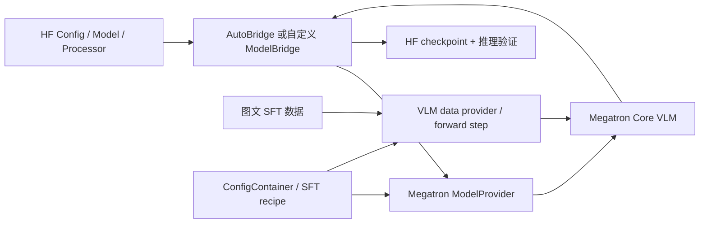

# MiniMind-V Megatron Bridge 接入

> [!warning]
> 本文包含 AI 生成或改写的实质内容，尚未完成人工核验。实现相关结论需要在锁定具体代码版本后，以代码、单元测试和 GPU 实验为准。

- **记录时间**：2026-08-06 10:20
- **状态**：active

## 一句话

将 MiniMind-V 整理为 Hugging Face 兼容模型，在 Megatron Core 中实现等价的 VLM，并通过 Megatron Bridge 打通 HF ↔ Megatron 权重转换、SFT 训练和可复用 recipe。

## 问题与价值

- **想解决的问题**：通过一个参数量小、结构完整的 VLM，系统学习 SFT 数据链路、Megatron Core 模型实现、并行训练和 checkpoint 转换。
- **目标用户或场景**：个人学习；优先保证单卡可调试、结果可解释，再扩展到多卡并行。
- **为什么值得做**：MiniMind-V 规模较小，适合验证端到端链路；Megatron Bridge 将配置、训练入口和 HF ↔ Megatron 转换组织在同一套框架中，适合用来理解“模型实现—数据—训练—checkpoint”之间的边界。
- **最终体验目标**：从一个固定的 HF checkpoint 和数据集出发，通过单一 recipe 启动 SFT，并能将训练结果导回 HF 格式做推理验证。

> [!important]
> “接入 Megatron Bridge”不只是编写一个 recipe。若 MiniMind-V 还没有现成的 `ModelProvider` 与 `AutoBridge` 映射，需要先完成模型定义、权重转换、VLM forward step 和数据适配；recipe 是这些能力稳定后的配置封装。

## 项目范围

### 本期目标

1. 固定 MiniMind-V、Megatron Bridge、Megatron-LM/Megatron Core 的版本与基线输出。
2. 明确 MiniMind-V 的 HF 契约：`Config`、`Model`、`Processor`、tokenizer、图像占位符和 checkpoint 命名。
3. 在 Megatron Core 中实现最小等价 VLM：vision encoder、projector、LLM 及其拼接/位置编码逻辑。
4. 实现 HF → Megatron 导入和 Megatron → HF 导出，并验证权重映射完整性与数值一致性。
5. 跑通单卡、短序列、小数据集的 SFT smoke test。
6. 封装可复用的 MiniMind-V SFT recipe，再逐步增加并行和性能配置。

### 暂不纳入首个里程碑

- 大规模预训练、RL、量化和推理服务化。
- 一开始就追求 TP/PP/CP 等多种并行组合或峰值吞吐。
- 在基线尚未对齐时同时改模型结构、数据格式和训练目标。
- 兼容 MiniMind-V 所有历史版本与 checkpoint。

## 接入边界

需要分别处理以下契约：

| 层次 | 关键对象 | 需要回答的问题 | 首要验证 |
| --- | --- | --- | --- |
| HF 模型侧 | `PretrainedConfig`、`PreTrainedModel`、processor/tokenizer | 模型结构和多模态输入能否被稳定序列化、重新加载 | 同一 checkpoint 重载后 logits 一致 |
| Megatron 模型侧 | `ModelProvider`、VLM module | vision、projector、LLM 的计算与 HF 侧是否等价 | 固定输入下关键中间张量与 logits 对齐 |
| 权重转换 | `ModelBridge`、参数名/shape transform | 每个 HF 参数最终落到哪个 Megatron 参数；TP/PP 下如何切分 | key 覆盖完整，HF → MCore → HF round-trip 可验证 |
| 数据与训练 | dataset provider、processor、forward step、loss mask | 图像 token、labels、position ids、attention/loss mask 如何构造 | 单 batch forward/backward，loss 有限且可复现 |
| Recipe | `ConfigContainer`、`finetune()` | 哪些配置是模型默认值，哪些由环境或实验覆盖 | 一条入口命令可重复启动 smoke test |

## 需要先冻结的基线

在写 Bridge 代码前记录以下信息，避免上游变化导致“边接入边漂移”：

- MiniMind-V 仓库 commit、目标模型型号和 HF checkpoint revision。
- Megatron Bridge commit/release，以及其绑定的 Megatron-LM/Megatron Core commit。
- Python、PyTorch、CUDA、Transformer Engine、GPU 型号和架构。
- tokenizer 与 processor 文件；图像分辨率、patch/token 数、图像占位符 ID。
- vision encoder、projector、LLM 的具体配置和冻结策略。
- 一组固定的图文输入，以及 HF 基线的输入张量、关键中间张量、logits 和 loss。

上游 MiniMind-V 仍在演进，当前公开仓库已经采用 Transformers 风格并提供原生 PyTorch/HF 两种加载路径，但目标分支、模型型号和 checkpoint 仍需在开发开始前锁定。[待核验]

## 分阶段实施方案

### P0：环境与基线

- 在 DGX Spark 上建立可复现开发环境，保存依赖版本和硬件信息。
- Megatron-LM 使用 workspace 中的源码，而不是只依赖镜像内安装版本，确保可以断点调试和修改。
- 分别为 Megatron Bridge、Megatron-LM 建立开发分支，并记录二者的基线 commit 对应关系。
- 用目标 HF checkpoint 跑通单样本推理和单 batch loss，保存基线产物。

**退出条件**：固定输入能够稳定复现；重新启动环境后仍能加载同一模型和数据。

### P1：规范化 HF 模型契约

- 确认 `config.json` 能完整描述 vision encoder、projector、LLM 和多模态特殊 token。
- 确认 `save_pretrained()` / `from_pretrained()` 不依赖仓库外的隐式状态。
- 固定输入字段、tensor shape、dtype、padding side、label ignore index 和图像预处理参数。
- 明确训练时冻结哪些参数，以及参数组名称是否能被稳定匹配。

**退出条件**：HF checkpoint 可独立加载；保存前后 state dict、processor 行为和固定输入 logits 一致。

### P2：Megatron Core 最小模型

- 先使用 `TP=1, PP=1, CP=1` 实现单进程模型，不提前引入切分复杂度。
- 显式实现并核对：vision features 选择、projector、图像 token 替换/拼接、position ids、attention mask、loss mask。
- 检查 tiny model 的 hidden size、attention heads、FFN size 等能否满足 Megatron Core 和 Transformer Engine 的约束。
- 用 hook 或显式 debug 输出逐层比较 HF 与 MCore 的中间张量。

**退出条件**：在相同权重、相同输入和约定容差下，关键中间张量及最终 logits 对齐；单 batch backward 成功。

### P3：HF ↔ Megatron 权重转换

- 建立逐参数映射表，覆盖 vision encoder、projector、embedding、decoder layers、norm 和 LM head。
- 对 QKV/门控 FFN 等可能发生融合、转置或切分的参数单独记录变换规则。
- 检查 tied embedding、buffer、额外 state 和未消费 key，禁止静默忽略。
- 先完成单卡 round-trip，再验证 TP/PP checkpoint 的切分与聚合。

**退出条件**：转换报告中没有无法解释的 missing/unexpected keys；HF → MCore 与 MCore → HF 后均能通过固定输入验证。

### P4：VLM SFT 链路

- 将 MiniMind-V 的 Parquet/图文样本转换或适配到稳定的数据契约。
- 明确 `input_ids`、pixel values、labels、position ids、attention mask、loss mask 的 producer 与 consumer。
- 复现原训练策略：例如 vision/projector/LLM 哪些层冻结或训练，但不预设当前上游默认值。[待核验]
- 先做 1 batch overfit，再做几十步 smoke test，最后再接完整数据。

**退出条件**：loss 有限且能下降；可保存、恢复并继续训练；导出 HF 后能完成最小推理回归。

### P5：Recipe 与并行扩展

- 将模型、optimizer、scheduler、precision、dataset、checkpoint 和 logger 配置收敛到一个 `ConfigContainer`。
- 提供 MiniMind-V SFT recipe；如确有需要，再增加 PEFT 或 pretrain recipe。
- 依次验证 DP → TP → PP；每引入一种并行方式都重复 conversion、forward 和短训练检查。
- recipe 的默认配置以“可运行、可复现”为优先，性能配置单独记录硬件适用边界。

**退出条件**：从干净环境用单一入口完成数据加载、训练、checkpoint 保存及 HF 导出；README 中的命令可复现。

## 最小验证

用成本最低的方式验证最关键的假设。

- **关键假设**：MiniMind-V 的计算图可以映射到现有 Megatron Core 组件，不需要为了接入而改变模型语义。
- **验证方式**：选择 tiny config、单张图、短文本、`TP=PP=CP=1`，使用同一组权重同时运行 HF 和 MCore forward；按 vision output、projector output、融合后的 embeddings、若干 decoder layer output、最终 logits 逐层比较。
- **成功标准**：
  - state dict 中每个参数都有明确映射或明确的排除理由；
  - 关键张量 shape、dtype 和 mask 语义一致；
  - 数值误差在事先约定的 dtype 相关容差内，而不是只比较生成文本；
  - 单 batch forward/backward、checkpoint save/load 和 HF round-trip 均通过；
  - 1 batch overfit 时 loss 明显下降。

## 主要风险与检查点

- **版本耦合**：Megatron Bridge 会绑定特定 Megatron Core 版本；workspace override 必须记录实际 import 路径和 commit，防止运行时仍加载镜像内包。
- **结构并非直接一一对应**：QKV、门控 FFN、tied embedding 等可能存在融合、转置和分片，不能只按参数名复制。
- **多模态语义漂移**：processor、图像占位符、padding、position ids 或 loss mask 任一处不同，都可能造成 logits 不一致。
- **小模型内核约束**：MiniMind-V 的维度可能不满足部分并行或 Transformer Engine kernel 的要求；应先验证 PyTorch/MCore 基线，再决定是否调整实现或禁用特定优化。[待核验]
- **冻结策略错误**：参数名变化可能让 `requires_grad` 过滤失效；训练前应输出 trainable parameter 清单和数量。
- **数据链路过早复杂化**：首个验证集应固定且极小，暂不同时引入 packing、动态分辨率、多数据源混合。
- **“能训练”不等于“等价”**：loss 能下降只能证明链路可运行，不能替代 HF/MCore 数值对齐和 checkpoint round-trip。

## 下一步

- [ ] 锁定 MiniMind-V 目标仓库、commit、模型型号和 HF checkpoint revision
- [ ] 建立 DGX Spark 开发环境，包括模型权重、数据集和固定图文样本
- [ ] Megatron-LM 使用 workspace 下的源码而非镜像中版本，并验证实际 import path
- [ ] 建立 Megatron Bridge、Megatron-LM 开发分支，记录基线 commit 对应关系
- [ ] 跑通 HF 单样本推理与单 batch loss，保存对齐基线
- [ ] 输出 HF 参数名 ↔ MCore 参数名映射草表
- [ ] 选取一个现有小型 VLM Bridge 作为 provider、conversion、recipe 和测试结构参考
- [ ] 明确首个里程碑只做 SFT，还是同时包含 HF 双向转换

## 待确认问题

1. 目标是当前 MiniMind-V 的哪个模型版本：dense、MoE，还是某个自定义分支？
2. “megatron-hf 版本”是指先重构 MiniMind-V 的 HF 实现，还是直接复用当前 Transformers 兼容实现？
3. 首个 checkpoint 从哪里来，vision encoder 与 LLM 是否都需要导入？
4. 第一阶段需要保持与原 MiniMind-V 训练策略完全一致，还是只要求标准全参数 SFT？
5. 最终贡献目标是业务仓库内维护，还是向 Megatron Bridge 上游提交正式模型支持？这会影响目录、测试和文档要求。
6. DGX Spark 上优先验证单 GPU，还是需要从一开始覆盖多 GPU/多节点？

## 补充材料

- **相关笔记**：暂无。
- **参考资料**：
  - [MiniMind-V 官方仓库](https://github.com/jingyaogong/minimind-v)
  - [Megatron Bridge 官方仓库](https://github.com/NVIDIA-NeMo/Megatron-Bridge)
  - [Megatron Bridge：Using Recipes](https://docs.nvidia.com/nemo/megatron-bridge/latest/recipe-usage.html)
  - [Megatron Bridge：Adding New Model Support](https://docs.nvidia.com/nemo/megatron-bridge/latest/skills/adding-model-support/SKILL.html)
- **证据边界**：以上实施方案基于 2026-08-08 查阅的官方公开资料；尚未检查目标代码 checkout、checkpoint、DGX Spark 环境或实际训练日志，因此所有实现细节仍需落到固定 commit 后核验。

## 升格记录

- **处理决定**：从 Inbox 中的项目构想升格为正式项目。
- **原始记录**：`01_Inbox/minimind megatron-bridge 接入.md`
- **决定日期**：2026-08-08
- **原因**：目标、接入边界、实施阶段、验收条件和近期行动已经明确，具备进入执行阶段的条件。
