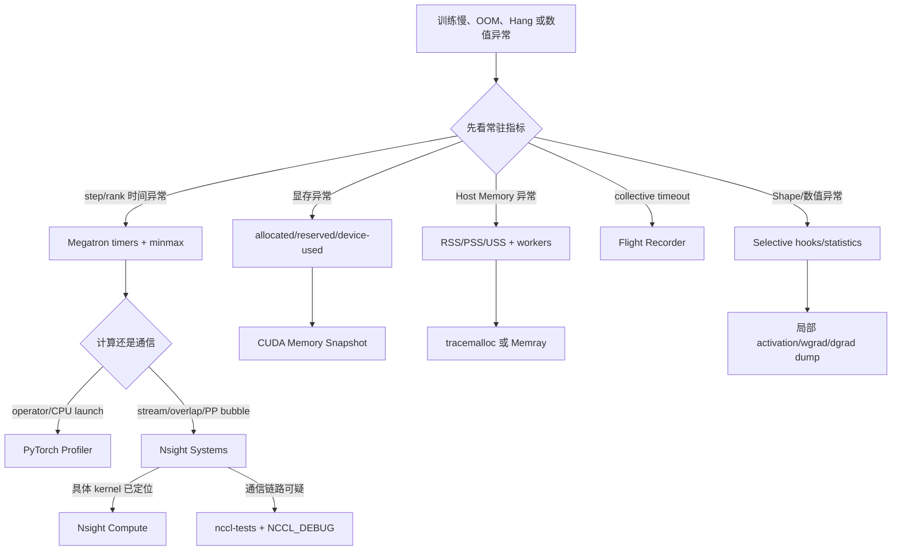

# Megatron-LM 训练引擎 Profiling & Debug 实践指南

> [!warning]
> 本文包含 AI 整理的技术说明与操作建议，尚未在具体集群、Megatron 版本和训练配置上逐项验证。

> 面向 Megatron-LM / Megatron-Core / Megatron-Bridge 训练任务，覆盖性能、GPU 显存、Host Memory、网络通信以及 Tensor Shape、Forward/Backward Debug。
>
> **版本说明**：本文依据 2026-08-06 可访问的 Megatron-LM `main`、Megatron-Bridge `latest` 和相关工具官方文档整理。Megatron 主线参数仍在持续演进，落地时应使用当前环境中的 `--help` 或配置类定义核对参数名。

## 目录

- [[#1. 核心结论|1. 核心结论]]
- [[#2. 工具分层与能力矩阵|2. 工具分层与能力矩阵]]
- [[#3. 推荐排查流程|3. 推荐排查流程]]
- [[#4. L0：常驻低开销观测|4. L0：常驻低开销观测]]
- [[#5. 性能分析|5. 性能分析]]
- [[#6. GPU 显存分析|6. GPU 显存分析]]
- [[#7. Host Memory 分析|7. Host Memory 分析]]
- [[#8. 网络通信分析|8. 网络通信分析]]
- [[#9. Tensor Shape 与 Forward/Backward Debug|9. Tensor Shape 与 Forward/Backward Debug]]
- [[#10. VLM、MoE 和多维并行的特殊注意事项|10. VLM、MoE 和多维并行的特殊注意事项]]
- [[#11. 推荐的五种标准模式|11. 推荐的五种标准模式]]
- [[#12. 输出目录与最小落地方案|12. 输出目录与最小落地方案]]
- [[#13. 常见误区|13. 常见误区]]
- [[#14. Reference|14. Reference]]

---

## 1. 核心结论

Megatron-LM 并不缺少 profiling 入口。当前主线已经提供了以下基础能力：

- iteration、forward、backward、optimizer 和通信相关 timer；
- rank 间 `min/max/all` 耗时统计；
- throughput、PyTorch allocator memory 和设备总显存日志；
- Nsight Systems 和 PyTorch Profiler 的 step/rank 范围控制；
- CUDA memory history 和 snapshot；
- NVTX range；
- NCCL Flight Recorder；
- activation、wgrad、dgrad 保存入口；
- GPU straggler/sniff test；
- Megatron-Bridge 中的 Tensor Inspect 集成。[R1][R2][R3][R14]

真正需要建立的是一套**分层排查方法**：

1. 先用低开销指标判断问题属于计算、通信、显存、Host Memory 还是数值/Shape；
2. 再用 PyTorch Profiler 或 Nsight Systems 抓取很短的稳定窗口；
3. 最后才使用 Nsight Compute、完整 Tensor Dump、Memray native tracing 等重工具。

不要同时记录所有 rank、所有 step、所有 shape、所有 stack 和所有 tensor。这样最先被分析出来的通常不是模型，而是文件系统为什么不堪重负。

---

## 2. 工具分层与能力矩阵

| 层级 | 主要工具 | 适合回答的问题 | 典型开销 |
|---|---|---|---|
| L0 常驻观测 | Megatron timers、throughput、memory log、straggler、Flight Recorder | 哪个阶段慢，哪个 rank 异常，显存是否增长，collective 是否挂死 | 低 |
| L1 框架级分析 | PyTorch Profiler、CUDA Memory Snapshot | 哪个 PyTorch op 慢，输入 shape 是什么，谁在分配 Tensor | 中 |
| L2 系统级分析 | Nsight Systems | CPU/GPU 是否空闲，CUDA Stream 和 NCCL 是否重叠，PP bubble 在哪里 | 中到高 |
| L3 专项深挖 | Nsight Compute、nccl-tests、Memray、Tensor Hook | 单个 kernel、硬件通信基线、native heap、层级数值偏差 | 高 |

### 需求到工具的快速映射

| 需求 | 第一选择 | 第二选择 | 不建议一开始使用 |
|---|---|---|---|
| 整体性能下降 | Megatron timers | Nsight Systems | Nsight Compute |
| 某个 operator 慢 | PyTorch Profiler | Nsight Systems | 全量 Tensor Dump |
| GPU 利用率低 | Nsight Systems | PyTorch Profiler | 只看 `nvidia-smi` |
| CUDA OOM | CUDA Memory Snapshot | PyTorch memory stats + NVML | 仅调用 `empty_cache()` |
| Host Memory 增长 | RSS/PSS/USS 采样 | tracemalloc / Memray | 只看训练主进程 RSS |
| NCCL timeout / hang | Flight Recorder | NCCL_DEBUG + Nsight Systems | `NCCL_DEBUG=TRACE` 长期开启 |
| 通信带宽异常 | nccl-tests | Nsight Systems | 直接修改大量 NCCL 环境变量 |
| Tensor Shape 错误 | selective hook | PyTorch Profiler shape | dump 全模型 activation |
| 数值对齐 / NaN | tensor statistics、gradient hook | activation/dgrad dump | 多机全量 `detect_anomaly` |

---

## 3. 推荐排查流程



### Profiling 窗口选择

建议采用：

- warmup 完成后的稳定 step；
- 1 个 warmup step；
- 2～3 个 active step；
- 1～3 个代表性 rank；
- profiling 期间关闭 checkpoint 和 evaluation 等非目标行为；
- 最终性能验证必须恢复真实生产配置，包括 CUDA Graph、overlap、packing 和真实 sequence length。

---

## 4. L0：常驻低开销观测

### 4.1 Megatron timer 与 throughput

当前 Megatron-LM `LoggerConfig` 提供：

- `log_throughput`；
- `timing_log_level = 0/1/2`；
- `timing_log_option = max/minmax/all`；
- TensorBoard timer 和 memory 输出；
- `log_device_memory_used`；
- gradient L2 norm 和 zero-gradient 统计。[R3]

推荐常驻参数示例：

```bash
BASELINE_ARGS=(
  --log-interval 10
  --log-throughput
  --timing-log-level 1
  --timing-log-option minmax
  --log-timers-to-tensorboard
  --log-memory-to-tensorboard
  --log-memory-interval 10
  --log-device-memory-used
  --tensorboard-dir /results/tensorboard
)
```

各 timing level 的语义：

- `0`：主要报告 iteration time，尽量避免额外开销；
- `1`：记录每个 iteration 少量执行的操作，例如 gradient reduce；
- `2`：记录更高频、更细粒度操作，可能明显影响 iteration time。[R3]

建议默认使用 `minmax`。平均时间会把 straggler 包装得像一个守法公民，而训练 critical path 由最慢 rank 决定。

### 4.2 建议长期记录的指标

```text
iteration_time_ms
samples_per_second_per_gpu
tokens_per_second_per_gpu
forward_time_ms
backward_time_ms
optimizer_time_ms
data_loading_time_ms
communication_timer_min/max
allocated_current/peak
reserved_current/peak
device_memory_used
host_rss/pss/uss
grad_norm
num_zeros_in_grad
```

### 4.3 Straggler 与 GPU Sniff Test

Megatron 主线的 `TrainingConfig` 中包含 `gpu_sniff_test_interval`，用于周期性测试 GEMM、all-to-all 和 send/recv，并标记吞吐偏离均值的 rank。[R3]

它适合快速区分：

- 模型负载不均；
- GPU 降频或硬件故障；
- NVLink、PCIe、NIC 或拓扑问题；
- MoE token imbalance；
- 变长样本或 PP stage 不均衡。

---

## 5. 性能分析

### 5.1 PyTorch Profiler：框架与 Operator 视角

PyTorch Profiler 可以记录 CPU/CUDA activity、input shape、memory、call stack 和自定义 `record_function` 区间。[R4][R5]

它适合回答：

- 哪个 PyTorch operator 最耗时；
- CPU launch 是否成为瓶颈；
- CUDA kernel 从哪个 Python/PyTorch op 发起；
- GEMM 的输入 shape；
- 某个 operator 是否创建了大量临时 Tensor；
- forward 和 backward 的调用关系。

#### Megatron-LM CLI 示例

```bash
PROFILE_ARGS=(
  --profile
  --use-pytorch-profiler
  --profile-step-start 20
  --profile-step-end 23
  --profile-ranks 0
  --pytorch-profiler-collect-shapes
)
```

需要定位调用来源时，再增加：

```bash
--pytorch-profiler-collect-callstack
```

#### Megatron-Bridge 配置示例

```python
from megatron.bridge.training.config import ProfilingConfig

cfg.profiling = ProfilingConfig(
    use_pytorch_profiler=True,
    profile_step_start=20,
    profile_step_end=23,
    profile_ranks=[0],
    pytorch_profiler_collect_shapes=True,
    pytorch_profiler_collect_callstack=False,
)
```

Megatron-Bridge 支持通过统一的 `ProfilingConfig` 设置 step 范围、目标 rank、shape 和 memory history；Nsys 与 PyTorch Profiler 在该配置中互斥。[R1]

#### 使用建议

第一轮只开启 CPU + CUDA activity。确认热点后再打开：

- `record_shapes`；
- `with_stack`；
- `profile_memory`。

这些选项单独看都很合理，一起打开则可能明显放大 trace、CPU 和内存开销。

---

### 5.2 Nsight Systems：系统时间线视角

Nsight Systems 适合观察：

- CPU 何时提交 CUDA kernel；
- GPU stream 之间是否有空洞；
- NCCL 与 GEMM/Attention/MLP 是否重叠；
- pipeline stage 的 bubble；
- DataLoader、Python GC 或 CPU launch 是否让 GPU 饥饿；
- collective 是否在各 rank 同步到达；
- CUDA memcpy、kernel、NCCL、NVTX 区间的关系。[R8]

#### 启动示例

```bash
nsys profile \
  -s none \
  -t cuda,nvtx,nccl,osrt \
  -o /results/nsys/node-${NODE_RANK:-0} \
  --force-overwrite true \
  --capture-range=cudaProfilerApi \
  --capture-range-end=stop \
  torchrun ... pretrain_gpt.py \
    ... \
    --profile \
    --profile-step-start 20 \
    --profile-step-end 22 \
    --profile-ranks 0 \
    --nvtx-ranges
```

Megatron 的 profiling 配置通过 `cudaProfilerStart/Stop` 将采集限制在指定 step；`nvtx_ranges` 用于增加语义范围。[R2]

#### 常见时间线模式

##### GPU kernel 之间有大量空白

优先检查：

- DataLoader；
- Python GC；
- `.item()`、`.cpu()`、`.numpy()` 和显式 synchronize；
- 动态 shape；
- 过多小 kernel；
- CPU launch overhead；
- CUDA Graph 是否可用。

##### NCCL 完全排在计算之后

说明通信 overlap 未生效或暴露较多，可能原因包括：

- bucket 粒度不合适；
- reduce/all-gather 启动过晚；
- stream dependency 不正确；
- CPU 没有及时提交 NCCL；
- PP stage 或 microbatch schedule 不平衡；
- TP/CP/EP 通信粒度和计算 kernel 粒度不匹配。

##### 某个 rank 尾部明显更长

优先怀疑：

- MoE token imbalance；
- 变长序列或 packing 不均衡；
- GPU 降频、ECC、Xid；
- 网卡/NIC affinity；
- PP layer 分配不均；
- 该 rank 承担 embedding、loss 或额外 I/O。

---

### 5.3 Nsight Compute：单 Kernel 深挖

Nsight Compute 是 CUDA kernel profiler，用于分析：

- Tensor Core 和 SM 利用率；
- occupancy；
- HBM/L1/L2 带宽与命中率；
- warp stall；
- register pressure；
- 指令吞吐。[R9]

合理顺序是：

```text
Megatron timers
  → PyTorch Profiler / Nsight Systems
  → 确定具体 kernel
  → Nsight Compute
```

不要直接对完整训练任务抓取所有 kernel 的完整 metric set。那不是深度分析，只是让 profiler 反复 replay 到训练任务失去原本的时间结构。

---

## 6. GPU 显存分析

### 6.1 必须区分三类数字

#### PyTorch allocated

活跃 Tensor 正在使用的显存：

```python
torch.cuda.memory_allocated()
```

#### PyTorch reserved

PyTorch caching allocator 已向 CUDA 申请并保留的显存：

```python
torch.cuda.memory_reserved()
```

#### Device used

NVML、`nvidia-smi` 或 `torch.cuda.device_memory_used()` 看到的设备总占用。

通常有：

```text
allocated <= reserved <= device_used
```

`device_used - reserved` 可能包括：

- CUDA context；
- NCCL buffer；
- Transformer Engine workspace；
- cuBLAS/cuDNN workspace；
- CUDA Graph memory pool；
- C++ 扩展或第三方库直接调用 CUDA API 的分配。

PyTorch Memory Snapshot 默认只能看到 PyTorch allocator 管理的分配，NCCL 是典型的不可见来源。[R6]

---

### 6.2 CUDA Memory Snapshot

#### Megatron 配置

```bash
--record-memory-history \
--memory-snapshot-path /results/memory/snapshot.pickle \
--profile-ranks 0
```

Megatron-Bridge 会为不同 rank 生成独立 snapshot 路径。[R1][R2]

#### 手动使用

```python
import torch

# 长任务必须限制 max_entries，避免记录自身吃掉大量 host memory。
torch.cuda.memory._record_memory_history(max_entries=100_000)

run_selected_iterations()

torch.cuda.memory._dump_snapshot(
    f"/results/memory/rank-{torch.distributed.get_rank()}.pickle"
)

torch.cuda.memory._record_memory_history(enabled=None)
```

snapshot 可以导入 PyTorch Memory Viz，分析：

- Active Memory Timeline；
- allocator segment/block 状态；
- allocation/free 调用栈；
- OOM event；
- inactive split blocks；
- 显存碎片；
- 长生命周期 activation；
- allocation size 抖动。[R6]

#### 新版 PyTorch 的 Pinned Host Memory

新版 API 可以记录 pinned host memory：

```python
torch.cuda.memory._record_memory_history(
    record_pinned_host_memory=True,
    max_entries=100_000,
)
```

目前 Memory Viz 对 host allocator 数据的展示能力有限，可以通过 snapshot 字典中的 `host_segments` 和 `host_traces` 程序化分析。[R6]

---

### 6.3 建议记录的显存指标

```text
allocated_bytes.current
allocated_bytes.peak
reserved_bytes.current
reserved_bytes.peak
active_bytes.current
inactive_split_bytes.current
num_alloc_retries
num_ooms
device_memory_used
```

#### 典型模式

| 现象 | 常见原因 |
|---|---|
| 峰值只在第一轮出现 | CUDA context、autotune、communicator、workspace、CUDA Graph capture |
| 每个 step 都持续增长 | Python 容器持有 Tensor、hook 未释放、loss 未 detach、异步任务积压 |
| reserved 高、allocated 低 | 正常缓存或 allocator fragmentation |
| device used 远高于 reserved | NCCL、CUDA Graph、TE workspace、第三方 CUDA 分配 |
| 不同 rank 峰值差异明显 | PP stage 差异、MoE imbalance、变长样本、额外 loss/embedding |

---

## 7. Host Memory 分析

Host Memory 至少拆成：

```text
训练 rank 的 RSS/PSS/USS
DataLoader worker 内存
Pinned host memory
Python object heap
C/C++ extension native heap
mmap/page cache/cgroup memory
```

### 7.1 常驻进程采样

```python
import os
import psutil


def get_host_memory_stats() -> dict[str, int]:
    process = psutil.Process(os.getpid())
    info = process.memory_full_info()

    children_rss = 0
    for child in process.children(recursive=True):
        try:
            children_rss += child.memory_info().rss
        except psutil.Error:
            pass

    return {
        "rss": info.rss,
        "pss": getattr(info, "pss", 0),
        "uss": getattr(info, "uss", 0),
        "children_rss": children_rss,
    }
```

Linux 侧还可以读取：

```bash
cat /proc/$PID/smaps_rollup
cat /sys/fs/cgroup/memory.current
```

只观察训练主进程 RSS 是不够的。DataLoader worker、tokenizer 和图片/视频解码进程可能在旁边安静地占满机器，训练 rank 则保持一脸无辜。

---

### 7.2 Python 对象：tracemalloc

`tracemalloc` 能记录 Python 分配调用栈、按文件/行统计内存，并比较两个 snapshot 以定位增长。[R12]

```python
import tracemalloc

tracemalloc.start(10)
before = tracemalloc.take_snapshot()

run_selected_iterations()

after = tracemalloc.take_snapshot()
for stat in after.compare_to(before, "lineno")[:20]:
    print(stat)
```

它只覆盖 Python allocator 能追踪的分配。RSS 在涨但 `tracemalloc` 没有明显增长时，应继续检查 native heap、pinned memory、mmap 或第三方库。

---

### 7.3 Native Heap：Memray

Memray 能追踪 Python 代码和 compiled extension 中的分配，并生成 flame graph、summary 和 table report。[R13]

```bash
memray run --native \
  -o /results/memray/rank0.bin \
  train_debug.py ...

memray flamegraph /results/memray/rank0.bin
```

建议在以下简化环境中使用：

- 单节点；
- 单 rank 或少量 rank；
- 少量 DataLoader worker；
- 小数据集；
- 能稳定复现 host memory 增长。

---

## 8. 网络通信分析

Megatron 中的“通信慢”可能发生在：

```text
GPU 内部/HBM
GPU ↔ GPU PCIe
GPU ↔ GPU NVLink/NVSwitch
Node ↔ Node InfiniBand/RoCE
NCCL collective 调度
CPU proxy thread
```

因此，看到 `all_reduce` 慢不能立刻断定网卡有罪。硬件经常有罪，但仍需一点点证据。

### 8.1 先测真实训练中的通信

重点观察：

- TP all-reduce/all-gather/reduce-scatter；
- DP gradient reduce-scatter；
- DP parameter all-gather；
- PP send/recv；
- CP P2P/all-gather；
- EP all-to-all；
- optimizer 通信。

区分三个量：

```text
总通信时间
与计算重叠的通信时间
暴露在 critical path 上的通信时间
```

可以定义：

```text
exposed_comm = NCCL 区间中没有与计算 kernel 重叠的部分

overlap_ratio = 1 - exposed_comm / total_comm
```

优化目标通常不是消灭 NCCL kernel，而是把更多 NCCL 时间藏在计算下面。

---

### 8.2 Nsight Systems 的 NCCL 时间线

通过 `-t cuda,nvtx,nccl` 查看：

- collective 发起时刻；
- 各 rank 是否同时到达；
- NCCL kernel 是否等待其他 rank；
- NCCL 和 GEMM 是否重叠；
- PP send/recv 是否位于关键路径；
- EP all-to-all 是否产生长尾。[R8]

---

### 8.3 nccl-tests：建立硬件基线

`nccl-tests` 用于区分：

- 训练框架调度问题；
- NCCL/拓扑/硬件链路本身的问题。

单机 8 GPU 示例：

```bash
./build/all_reduce_perf -b 1M -e 1G -f 2 -g 8
./build/all_gather_perf -b 1M -e 1G -f 2 -g 8
./build/reduce_scatter_perf -b 1M -e 1G -f 2 -g 8
./build/alltoall_perf -b 1M -e 1G -f 2 -g 8
```

多机测试应尽量保持与训练一致的：

- node/GPU 数量；
- rank mapping；
- container；
- NCCL 版本；
- NIC 和网络环境；
- message size 范围。

`nccl-tests` 同时报告 algorithm bandwidth 和 bus bandwidth；`busbw` 用于更合理地比较 collective 对物理互联的使用效率。[R11]

不要只跑一个超大 message size。TP/CP 可能由大量中小 collective 构成，8 GiB all-reduce 正常并不能证明这些通信正常。

---

### 8.4 NCCL_DEBUG

初始化和拓扑排查时建议：

```bash
export NCCL_DEBUG=INFO
export NCCL_DEBUG_SUBSYS=INIT,GRAPH,NET,TUNING
export NCCL_DEBUG_FILE=/results/nccl/nccl.%h.%p.log
```

可进一步按问题增加：

```text
COLL, P2P, PROXY, REG, ALLOC, ALLOC_HOST, NVLS
```

NCCL 官方文档列出了各 subsystem 的含义，并支持 `%h`、`%p` 分文件记录。[R10]

`NCCL_DEBUG=TRACE` 只应在极短复现中使用。

---

### 8.5 Flight Recorder：Hang 与 Collective Desync

Flight Recorder 使用内存环形缓冲区记录 collective 序列、状态、shape、dtype 和调用栈，并在 timeout 时 dump。[R7]

推荐环境变量：

```bash
export TORCH_NCCL_TRACE_BUFFER_SIZE=2000
export TORCH_NCCL_DUMP_ON_TIMEOUT=true
export TORCH_FR_DUMP_TEMP_FILE=/results/flight_recorder/trace_

# 可选，增加定位能力但有额外开销
export TORCH_NCCL_TRACE_CPP_STACK=true
export TORCH_NCCL_ENABLE_TIMING=true
export TORCH_SYMBOLIZE_MODE=fast
```

适合定位：

- 某个 rank 没有进入 collective；
- collective 顺序不一致；
- input/output shape 或 dtype 不一致；
- 某个 rank 提前异常；
- PP send/recv 序列错位；
- watchdog timeout。

Megatron 主线也把 Flight Recorder 的 dump path、buffer size、timeout dump 和 stack trace 配置纳入了 distributed config。[R2]

---

## 9. Tensor Shape 与 Forward/Backward Debug

### 9.1 Operator Shape：PyTorch Profiler

开启 shape 记录后，可以观察：

```text
aten::mm
aten::view
aten::transpose
aten::scaled_dot_product_attention
```

对应的输入 shape，适合判断：

- GEMM 的 M/N/K 是否合理；
- reshape/transpose 是否异常；
- attention 的 batch/head/sequence 维度；
- 小 shape 是否造成 kernel 效率低。

缺点是 operator 名缺少完整模型语义。大量 `aten::mm` 并不会主动解释自己属于第几层的 QKV 还是 MLP。

---

### 9.2 Module 级 Selective Hook

推荐默认只记录 metadata，不复制 tensor 值：

```python
from __future__ import annotations

import re
from typing import Any

import torch
import torch.distributed as dist
from torch import nn


def tensor_meta(value: Any) -> Any:
    if isinstance(value, torch.Tensor):
        return {
            "shape": tuple(value.shape),
            "dtype": str(value.dtype),
            "device": str(value.device),
            "stride": tuple(value.stride()),
            "contiguous": value.is_contiguous(),
            "requires_grad": value.requires_grad,
        }
    if isinstance(value, (tuple, list)):
        return [tensor_meta(x) for x in value]
    if isinstance(value, dict):
        return {k: tensor_meta(v) for k, v in value.items()}
    return type(value).__name__


def install_shape_hooks(
    model: nn.Module,
    module_pattern: str,
    enabled_ranks: set[int] = {0},
    max_events: int = 200,
):
    rank = dist.get_rank() if dist.is_initialized() else 0
    if rank not in enabled_ranks:
        return []

    pattern = re.compile(module_pattern)
    handles = []
    state = {"events": 0}

    def emit(tag: str, name: str, value: Any) -> None:
        if state["events"] >= max_events:
            return
        state["events"] += 1
        print(f"[rank={rank}] [{tag}] {name}: {tensor_meta(value)}", flush=True)

    for name, module in model.named_modules():
        if not pattern.search(name):
            continue

        handles.append(module.register_forward_pre_hook(
            lambda _m, args, name=name: emit("forward-input", name, args)
        ))
        handles.append(module.register_forward_hook(
            lambda _m, _args, out, name=name: emit("forward-output", name, out)
        ))
        def backward_hook(_module, grad_input, grad_output, *, name=name):
            emit("backward-grad-input", name, grad_input)
            emit("backward-grad-output", name, grad_output)
            return None

        handles.append(module.register_full_backward_hook(backward_hook))

    return handles
```

示例：

```python
handles = install_shape_hooks(
    model,
    module_pattern=r"(vision_model|linear_proj|self_attention|mlp)",
    enabled_ranks={0},
)
```

#### Hook 注意事项

1. activation recompute 会让 forward hook 在 backward 期间再次触发；
2. PP rank 只能看到本 stage 的 module；
3. TP/CP/EP 下看到的是 local shard shape；
4. Transformer Engine fused module 可能只暴露融合边界；
5. hook 中不要默认调用 `.cpu()`、`.numpy()` 或 `.item()`，这些操作会同步 CUDA；
6. 必须限制 rank、module regex、step 和事件数量。

---

### 9.3 保存 Activation、WGrad 和 DGrad

Megatron-LM 当前 `CheckpointConfig` 包含：

```text
save_activations_interval
save_wgrads_interval
save_dgrads_interval
```

用于按 iteration 保存 activation、weight gradient 和 data gradient。[R3]

它们适合：

- 训推对齐；
- Megatron/SGLang layer-by-layer 比较；
- 首个数值偏差层定位；
- backward 梯度流检查。

不适合正常性能分析，因为完整 Tensor Dump 会引入：

- CUDA 同步；
- D2H copy；
- Host Memory 峰值；
- 磁盘 I/O；
- 训练行为扰动。

推荐先保存摘要：

```text
shape / dtype
mean / std / min / max
L1 / L2 norm
finite ratio
checksum/hash
relative-L2
cosine similarity
```

只有某一层摘要首次出现异常时，再保存该层的完整 tensor。

---

### 9.4 Megatron-Bridge TensorInspectConfig

Megatron-Bridge 提供 `TensorInspectConfig`，集成 NVIDIA DL Framework Inspect，可记录 tensor statistics，并将结果输出到日志、TensorBoard 或 W&B。[R14]

可记录的统计包括：

```text
min / max / mean / std
L1 / L2 norm
current amax / dynamic range
FP8 underflow、scale、MSE 等
```

示意配置：

```python
from megatron.bridge.training.config import TensorInspectConfig

cfg.tensor_inspect = TensorInspectConfig(
    enabled=True,
    features="./conf/tensor_inspect.yaml",
    log_dir="/results/tensor_inspect",
)
```

该能力尤其适合：

- FP8/量化数值诊断；
- 特定 linear/MLP 层的 activation、gradient、weight、wgrad、dgrad 统计；
- 不希望自行维护大量 hook 的 Bridge 训练任务。

具体支持模块和 feature 依赖 Megatron-Bridge、Transformer Engine 与 `nvdlfw-inspect` 版本，使用前应核对当前版本文档。

---

### 9.5 NaN、Inf 与 Backward 异常

最小化单卡复现时可以使用：

```python
with torch.autograd.detect_anomaly(check_nan=True):
    loss.backward()
```

或为可疑 tensor 注册梯度 hook：

```python
def check_grad(name: str):
    def hook(grad: torch.Tensor):
        if not torch.isfinite(grad).all():
            print(f"{name}: non-finite gradient")
        return grad
    return hook

hidden_states.register_hook(check_grad("layer_12.hidden_states"))
```

完整多机训练中不建议开启全局 anomaly detection。先使用 Megatron 的 grad norm、zero-grad 和 loss NaN 检查定位 iteration，再缩小到单 stage/单 rank/单 layer。

---

## 10. VLM、MoE 和多维并行的特殊注意事项

### 10.1 Rank 选择不能只看 rank 0

建议至少覆盖：

- PP 第一个 stage：embedding、vision tower 或输入处理；
- PP 最后一个 stage：final norm、lm_head、loss；
- 一个中间 PP stage；
- 每个 node 至少一个 rank；
- 已知 straggler rank；
- MoE 中一个有代表性的 EP rank；
- CP 场景下至少两个不同 sequence shard rank。

### 10.2 VLM

建议分开标记：

```text
image/video decode
processor/tokenizer
vision tower
vision-to-language projector
multimodal token packing
LLM backbone
loss
```

VLM 常见瓶颈包括：

- CPU 图片/视频解码；
- 动态分辨率导致 shape 抖动；
- vision tokens 比例变化；
- projector 与 LLM pipeline stage 分布不均；
- pinned memory 和 H2D copy；
- DataLoader worker 的 Host Memory 增长。

### 10.3 MoE

除通用指标外，应额外记录：

```text
tokens_per_expert
max/mean tokens ratio
expert capacity/overflow
dispatch all-to-all time
combine all-to-all time
shared expert overlap
expert GEMM shape
```

Megatron 主线还提供 MoE routing trace 相关配置，可按 iteration 记录 router decision、logits 或 hidden states。[R3]

### 10.4 TP/CP/EP 下的 Shape 语义

hook 中看到的是 local tensor：

- TP：hidden/FFN/head 等维度可能被切分；
- sequence parallel：sequence 或 token 维度可能是 local shard；
- CP：sequence 维度只覆盖当前 context shard；
- EP：仅包含被路由到当前 expert rank 的 token；
- PP：只包含当前 stage 的 activation 边界。

因此日志中建议同时记录：

```text
global_rank/local_rank
TP/PP/CP/EP/DP rank
microbatch id
layer id
local shape
必要时推导出的 global shape
```

---

## 11. 推荐的五种标准模式

### 11.1 `baseline`

用于所有正常训练：

```text
iteration/throughput
timing level 1 + minmax
allocated/reserved/device-used
host RSS/PSS/USS
Flight Recorder
straggler detection
```

目标开销：尽量控制在 1%～2% 左右。

### 11.2 `torch-profile`

用于回答“哪个 PyTorch op 慢”：

```text
1 warmup + 2～3 active steps
1～3 ranks
第一轮不开 stack/memory
第二轮针对热点开启 shape/stack
```

### 11.3 `nsys`

用于回答“为什么 GPU 没跑满、通信为什么没重叠”：

```text
2 个稳定训练 step
关闭 checkpoint/eval
保留真实 overlap 和并行配置
用 NVTX 划分 vision/LLM/forward/backward/optimizer
```

### 11.4 `memory`

用于 OOM、增长和 fragmentation：

```text
CUDA Memory Snapshot
PyTorch memory_stats
NVML device used
RSS/PSS/USS
DataLoader worker memory
必要时 tracemalloc/Memray
```

### 11.5 `tensor-debug`

用于 Shape、训推对齐、NaN：

```text
单 microbatch
短 sequence
少量 rank
module regex
metadata/statistics 优先
完整 tensor dump 最后开启
```

---

## 12. 输出目录与最小落地方案

推荐统一目录：

```text
/results/profiling/<run-id>/
├── config/
│   ├── resolved_config.yaml
│   └── environment.txt
├── baseline/
│   ├── metrics.jsonl
│   └── tensorboard/
├── torch_profiler/
├── nsys/
├── memory/
├── host_memory/
├── nccl/
├── flight_recorder/
├── tensor_debug/
└── README.md
```

每次 profiling 至少保存：

```text
git commit
container image
PyTorch/CUDA/NCCL/Transformer Engine 版本
GPU/NIC/topology
Megatron 并行配置
batch/sequence/vision-token 配置
profile step 和 rank
是否开启 CUDA Graph、recompute、overlap
```

### 最小落地优先级

1. 统一 `baseline` 指标；
2. 默认启用 Flight Recorder；
3. 封装 PyTorch Profiler 的 step/rank 模式；
4. 封装 Nsys 的短窗口启动脚本；
5. 封装 CUDA Memory Snapshot；
6. 增加 selective shape/statistics hook；
7. 最后补充 Memray、Nsight Compute 和完整 Tensor Dump。

---

## 13. 常见误区

### 误区 1：只看平均 step time

critical path 由最慢 rank 决定，应至少看 min/max 和 straggler rank。

### 误区 2：只看 `nvidia-smi`

`nvidia-smi` 无法解释活跃 Tensor、allocator cache、NCCL buffer 和第三方 workspace 的构成。

### 误区 3：只 profile rank 0

rank 0 可能既不是最慢 rank，也不承担 loss、MoE 热点或中间 PP stage。

### 误区 4：profile 太多 step

2～3 个稳定 step 通常足够。长时间 trace 更容易制造 I/O、内存和行为扰动。

### 误区 5：看到通信慢就调整 NCCL 参数

先用 nccl-tests 建立基线，再通过 Nsight Systems 判断通信是否暴露、是否有 rank 到达不一致。

### 误区 6：Hook 中直接 `.cpu()`

会引入同步和 D2H copy，使原本的性能问题被 debug 代码重新定义。

### 误区 7：把 profiler 结果当作绝对真值

shape、stack、memory history、anomaly detection 都会改变运行行为。最终结论必须回到接近生产配置的短窗口复测。

---

## 14. Reference

### Megatron-LM / Megatron-Bridge

- **[R1]** NVIDIA, *Megatron Bridge: Profiling*.  
  https://docs.nvidia.com/nemo/megatron-bridge/latest/training/profiling.html

- **[R2]** NVIDIA Megatron-LM, `megatron/training/config/common_config.py`: `ProfilingConfig`、`DistributedInitConfig` 和 Flight Recorder 配置。  
  https://github.com/NVIDIA/Megatron-LM/blob/main/megatron/training/config/common_config.py

- **[R3]** NVIDIA Megatron-LM, `megatron/training/config/training_config.py`: timers、throughput、memory log、GPU sniff test、activation/wgrad/dgrad、MoE routing trace。  
  https://github.com/NVIDIA/Megatron-LM/blob/main/megatron/training/config/training_config.py

- **[R14]** NVIDIA, *Megatron Bridge Logging and Monitoring: Tensor Inspection*；`TensorInspectConfig` API。  
  https://docs.nvidia.com/nemo/megatron-bridge/latest/training/logging.html  
  https://docs.nvidia.com/nemo/megatron-bridge/latest/apidocs/bridge/bridge.training.tensor_inspect.html  
  https://docs.nvidia.com/nemo/megatron-bridge/latest/apidocs/bridge/bridge.training.config.html

### PyTorch

- **[R4]** PyTorch, *torch.profiler API*.  
  https://docs.pytorch.org/docs/stable/profiler.html

- **[R5]** PyTorch, *Profiler Recipe*.  
  https://docs.pytorch.org/tutorials/recipes/recipes/profiler_recipe.html

- **[R6]** PyTorch, *Understanding CUDA Memory Usage*.  
  https://docs.pytorch.org/docs/main/torch_cuda_memory

- **[R7]** PyTorch, *Flight Recorder for Debugging Stuck Jobs*.  
  https://docs.pytorch.org/tutorials/unstable/flight_recorder_tutorial.html

### NVIDIA Profiling / Communication

- **[R8]** NVIDIA, *Nsight Systems User Guide*.  
  https://docs.nvidia.com/nsight-systems/UserGuide/index.html

- **[R9]** NVIDIA, *Nsight Compute User Guide and Profiling Guide*.  
  https://docs.nvidia.com/nsight-compute/NsightCompute/index.html  
  https://docs.nvidia.com/nsight-compute/ProfilingGuide/index.html

- **[R10]** NVIDIA, *NCCL Environment Variables and Logging*.  
  https://docs.nvidia.com/deeplearning/nccl/user-guide/docs/env.html  
  https://docs.nvidia.com/deeplearning/nccl/user-guide/docs/troubleshooting/logging.html

- **[R11]** NVIDIA, *nccl-tests*.  
  https://github.com/NVIDIA/nccl-tests  
  https://github.com/NVIDIA/nccl-tests/blob/master/doc/PERFORMANCE.md

### Host Memory

- **[R12]** Python, *tracemalloc — Trace memory allocations*.  
  https://docs.python.org/3/library/tracemalloc.html

- **[R13]** Bloomberg, *Memray Documentation*.  
  https://bloomberg.github.io/memray/

