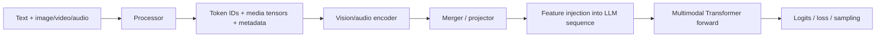

# 多模态模型数据流

## 端到端路径

多模态对齐最常见的错误不是单个矩阵计算，而是 processor 与模型之间的结构契约被破坏。

## 三种 token 口径

至少区分：

1. **原始媒体 token/patch 数**：视觉或音频 encoder 实际接收的序列长度。
2. **合并后媒体特征数**：经过 spatial/temporal merge 或 resampler 后的长度。
3. **LLM 序列中的媒体占位 token 数**：用于注入特征的语言序列位置数。

它们之间可能是固定倍率，也可能依赖分辨率、帧数、dynamic tiling 或 pooling。显存分析和 packing 限制必须说明使用哪一种。

## Processor 契约

记录以下内容：

- chat template 与 special token IDs。
- 图片尺寸、resize/crop、patch size、merge size、frame sampling。
- 媒体顺序与 prompt 中占位符顺序。
- 每个媒体对象的 feature length、offset 和 hash。
- text/vision position IDs，尤其 M-RoPE 分段。
- packing 后样本边界、media-to-sample mapping 和 loss mask。

“图片相同”不能证明模型输入相同；预处理参数、库版本和 metadata 都属于输入身份。

## 模型所有权边界

真实项目常把能力分散在多个仓库：基础 LLM、multimodal composition、训练 runtime、推理 runtime 和 processor/dataset。判断问题归属时沿实际 import/provider chain 查找：

- 纯文本 backbone / tokenizer / MoE 通常属于语言模型实现。
- vision/audio encoder、projector、modality injection 和 processor 通常属于多模态实现。
- TP/PP/CP/EP、checkpoint 和 optimizer 可能属于通用训练框架。
- batching、KV cache、sampling 与请求生命周期属于推理 runtime。

具体方法见 [[20_Knowledge/Systems/跨仓库调用链追踪|跨仓库调用链追踪]]。

## Packing 的风险面

- 只对 token IDs 进行 concat，却未同步 position IDs、media offsets 或 cu-seqlens。
- 媒体 feature 在 CPU/GPU/IPC 之间传输后，request identity 丢失。
- LLM token 计数与 raw vision token 计数混用，导致容量估算失真。
- 多个样本中的相同占位 token 被映射到错误的媒体对象。
- processor 过滤/截断样本，但 reward、log-prob 或 group metadata 未同步。

## 跨 Runtime 对齐

按以下顺序建立证据：

1. 原始媒体 hash 和 processor 配置一致。
2. token IDs、媒体 tensor/feature 与长度一致。
3. special tokens 和 feature injection 位置一致。
4. position IDs、mask 和 packed boundaries 一致。
5. vision encoder、projector、LLM 中间层逐级比较。

仅用 semantic module name 或“第几个 pass”匹配 dump 容易串请求；优先使用 request/session ID、token/media hash、phase、tensor path 和 shard coordinates。

## 相关笔记

- [[20_Knowledge/Inference/推理系统与训练对齐|推理系统与训练对齐]]
- [[20_Knowledge/Memory/显存分析方法|显存分析方法]]
- [[40_Runbooks/跨 Runtime 数值对齐|跨 Runtime 数值对齐]]
