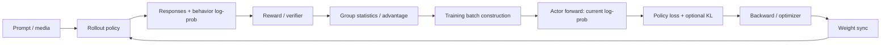

# LLM 强化学习训练链路

> [!warning]
> 公式和字段语义随 PPO/GRPO 变体及代码库变化。使用时必须对照目标 trainer、loss 和数据结构。

## 闭环

## 样本身份与批次语义

同时区分：

- dataset prompt 数。
- 每个 prompt 的 rollout/group size。
- rollout 并发数。
- 经过过滤后保留的 response 数。
- global batch、data-parallel batch、micro-batch。
- packing 后每次 forward 的 token 数。

这些量名字相似但控制不同资源。`max_tokens_per_mb` 一类配置通常限制 forward packing，而不直接定义 GRPO group 或 global batch。

## Log-prob 的角色

| 量 | 常见来源 | 用途 |
| --- | --- | --- |
| behavior / old log-prob | 生成时策略 | importance ratio 的分母或行为记录 |
| current actor log-prob | learner 当前 forward | 参与策略梯度 |
| reference log-prob | 冻结参考策略 | KL 正则或监控 |

它们必须在同一 token、同一 mask 和清晰的权重版本语义下比较。生成引擎返回的 sampler log-prob 是否等价于训练侧所需 log-prob，需要沿 [[20_Knowledge/Inference/推理系统与训练对齐|推理对齐]] 链路验证。

## Advantage

组内标准化的抽象形式可写为：

$$
A_i = \frac{r_i-\mu_G}{\sigma_G+\epsilon},
$$

其中 $G$ 是同一 prompt 的响应组。但真实实现可能包含多奖励聚合、过滤、长度归一、leave-one-out、token-level credit 或全局/局部归一。不要只根据“GRPO”名称推断实现。

## Loss 与 Mask

策略目标通常只作用在 response token。需明确：

- prompt token 是否 mask。
- EOS 是否计入 loss。
- 过长截断、无 EOS、role-end token 如何处理。
- padding、packing boundary 与多模态占位 token 是否计入。
- KL 是加入 reward、advantage，还是直接加入 loss。
- per-token loss 如何聚合为 per-sample/per-group/global loss。

Mask 语义不同会造成 log-prob 指标、loss 与梯度都不同，即使模型 forward 完全一致。

## 分布式系统边界

一个常见系统可能包含 dataset/workflow、rollout engines、reward workers、reference workers、actor learners、scheduler/controller 和 metric sink。字段经过 RPC 或对象存储时应追踪：

1. producer 的类型、shape 与身份。
2. 序列化与 batch merge/split。
3. worker group 与 rank ownership。
4. consumer 是否复制、裁剪、重排或转 dtype。
5. 最终是否返回 metrics、tensor 或更新后的权重。

## 常见失败

- Group size、batch size 与 rollout concurrency 混淆，导致容量或同步假设错误。
- 只看到 `ref_logprobs` 字段存在，就认定 KL 一定进入 loss。
- behavior/current/reference 权重版本不清楚。
- EOS 或 packing mask 不一致导致“无 EOS 样本 log-prob 差异”。
- 大 tensor 被放入 scheduler/RPC 的非批量 payload，触发序列化或容量问题。
- 训练 worker 的本地 metric tracker 被误认为最终 TensorBoard sink，忽略跨进程返回链路。

## 相关笔记

- [[20_Knowledge/Inference/推理系统与训练对齐|推理系统与训练对齐]]
- [[20_Knowledge/Systems/跨仓库调用链追踪|跨仓库调用链追踪]]
- [[20_Knowledge/Multimodal/多模态模型数据流|多模态模型数据流]]
