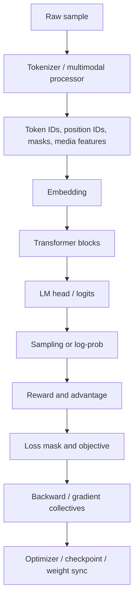

# Transformer 系统地图

## 从 token 到更新后的参数

## 层次关系

| 层次 | 核心对象 | 关键问题 |
| --- | --- | --- |
| 数学语义 | attention、MLP、normalization、loss | 公式与 mask 是否一致？ |
| 张量实现 | shape、dtype、layout、kernel | 广播、切分、累积精度是否一致？ |
| 模型并行 | TP、PP、CP、EP、SP | 哪一维被切分，何时通信？ |
| Runtime | schedule、cache、batch、stream | 执行顺序与状态生命周期是什么？ |
| RL 系统 | rollout、reward、log-prob、advantage | 样本身份、版本与 mask 是否保持一致？ |
| 运维 | process、rank、pod、node、device | 失败发生在哪里，证据是否跨边界？ |

## 高频连接

- Attention 激活规模连接 [[20_Knowledge/Memory/显存分析方法|显存分析]] 与 [[20_Knowledge/Distributed/大模型并行训练#Context Parallelism（CP）|CP]]。
- Logits 和 log-prob 的 dtype、mask 与 token 对齐连接 [[20_Knowledge/Inference/推理系统与训练对齐|推理对齐]] 与 [[20_Knowledge/RL/LLM 强化学习训练链路|RL 训练]]。
- 图片经过 processor 产生的 token/features/position IDs 连接 [[20_Knowledge/Multimodal/多模态模型数据流|多模态数据流]] 与 [[40_Runbooks/跨 Runtime 数值对齐|数值对齐 Runbook]]。
- 参数、激活、临时 buffer 与通信 workspace 共同决定 [[40_Runbooks/OOM 排查|OOM]]，不能只用参数量解释峰值。

## planned

- Attention 与 FlashAttention
- RoPE、M-RoPE 与 position IDs
- Normalization 与混合精度
- MoE 路由、负载均衡与 Expert Parallel
- KV cache 与 continuous batching
- Collective 通信成本模型
